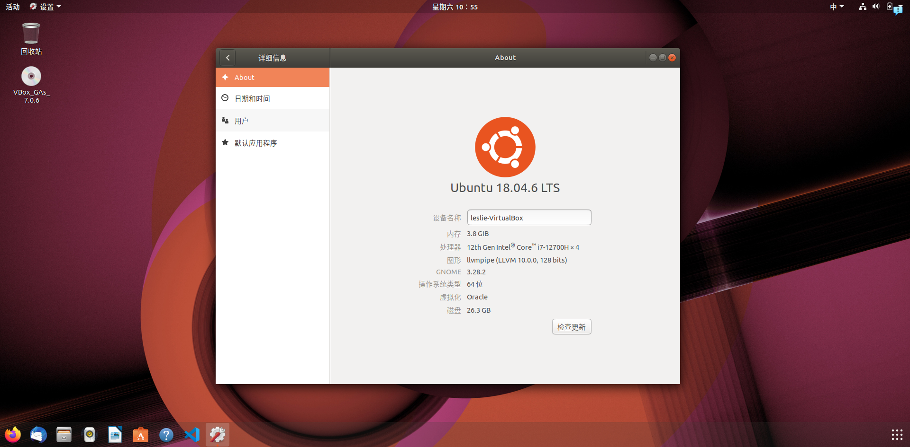
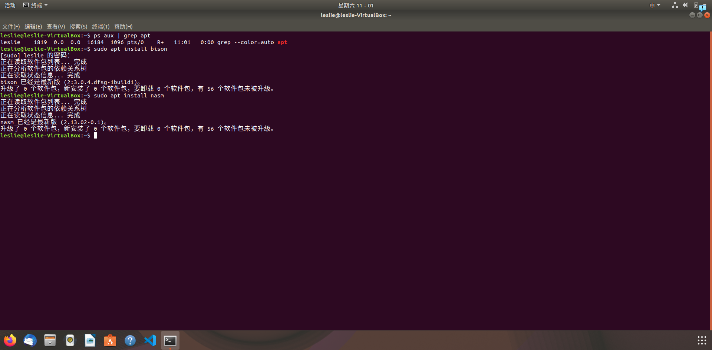

### 一、实验要求
- 熟悉现有Linux内核的编译过程和启动过程， 并在自行编译内核的基础上构建简单应用并启动。同时利用精简的 Busybox 工具集构建简单的 OS， 熟悉现代操作系统的构建过程。此外熟悉编译环境、相关工具集，并能够实现内核远程调试。
### 二、实验过程
> 注：由于撰写实验报告前已经将实验完成，故部分需要生成的文件在撰写时直接展示，没有再次下载或者生成打包
#### 1. 环境配置
- 利用 $virtualbox$ 启动 $ubuntu18.04$  
    
- 换清华源
    
- 配置C/C++环境
    
- 安装其他工具
    
    *·已经全部安装，此处仅举 bison 和 nasm 展示*
- 安装 Visual Studio Code 及所需插件
    
#### 2. 编译Linux内核
- 下载内核 5.10.x 并解压，进入该文件夹
    
- 编译内核成 i386 32位 版本
    
    
- 编译内核
    
    *· 展示的是已编译的结果*
- 检查符号表 vmlinux 和 bzImage 是否已经生成
    
#### 3. 启动内核并调试
- 观察到因为没有指定 initrd 文件，输出为:`Unable to mount root fs on unknown-block(0,0)`
  
#### 4. 制作Initramfs
- 制作 "Hello World!" Initramfs
  - 用 Vim 编写程序（`Shift` + `;`，输入`w`写入，再同样输入`q`退出）
    
  - 编译成 32 位可执行文件
    
- 加载 Initramfs
  
  看到输出了：`lab1: Hello World\n`
#### 5. 编译并启动 BusyBox
- 下载并解压
    
- 编译 BusyBox
    
    
    
- 制作 Initramfs
    - _install目录下的文件和目录取出放在`~/lab1/mybusybox`处
    
    - 由于 Initramfs 需要一个 init 程序，写一个 shell 脚本作为 init（用文本编辑器 VIM）
    
    - 将 mybusybox 中的内容打包归档成 cpio 文件
    
    - 加载 busybox
    
### 三、关键代码
- 无
### 四、实验结果
- 在 [二、实验过程](#二-实验过程)五部分（环境配置、编译Linux内核、启动内核并调试、制作Initramfs、编译并启动Busybox）已经截图实验结果
### 五、总结
- 学习了 Linux 系统的命令功能，熟悉 Vim 文本编辑器等常用工具使用方法，收获颇丰
- 在实验中搭建 OS 环境，下载编译内核并实现内核远程调试，学习制作 Initramfs 的方法，编译 BusyBox 并随内核启动
- 实验文档详实细致，实验过程步步为营，甚是愉悦体验！工欲利其事，必先利其器，配好环境，为后续实验做好准备!