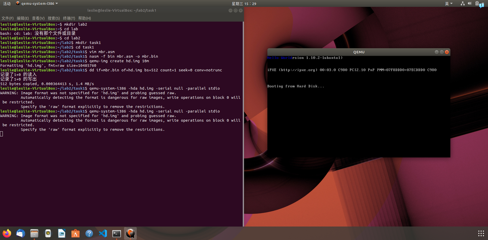
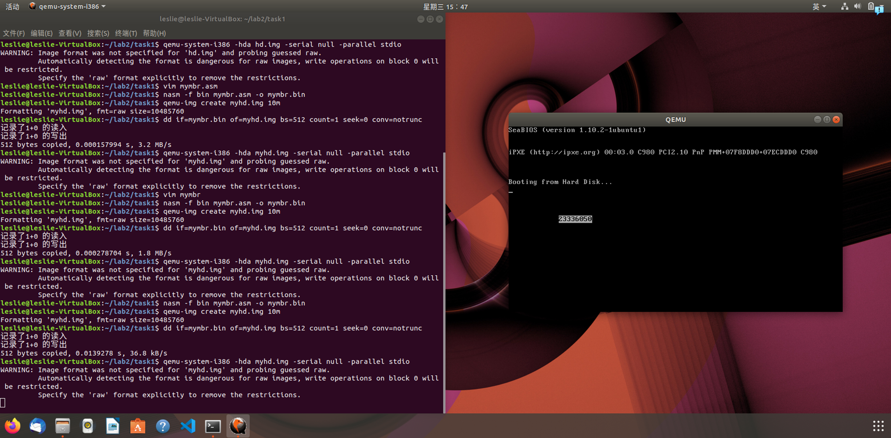
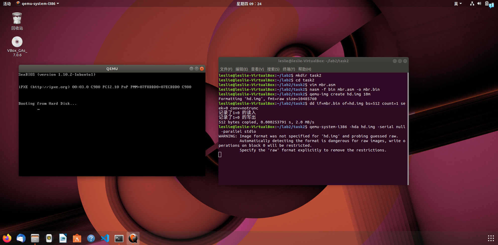
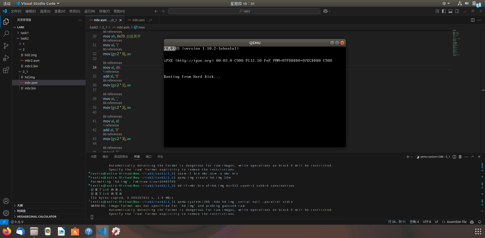
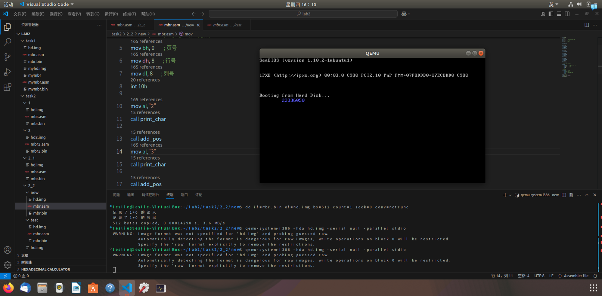
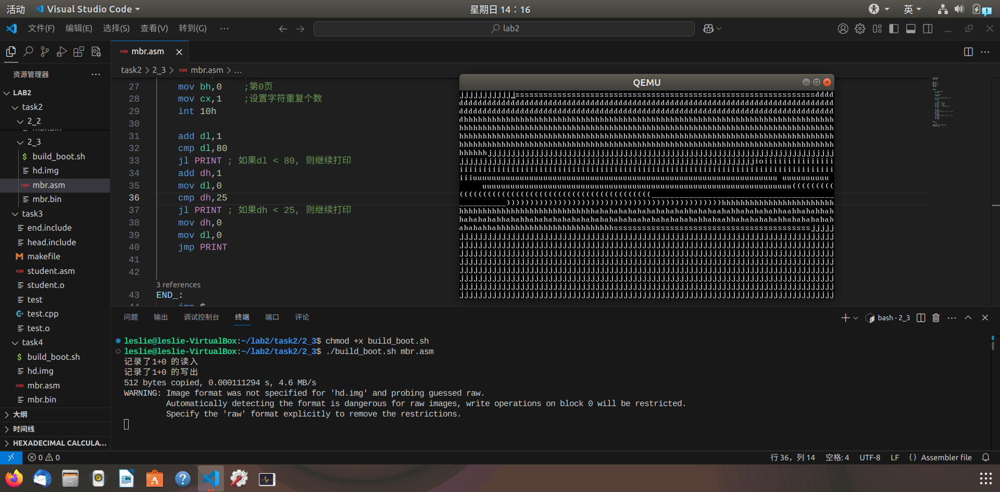
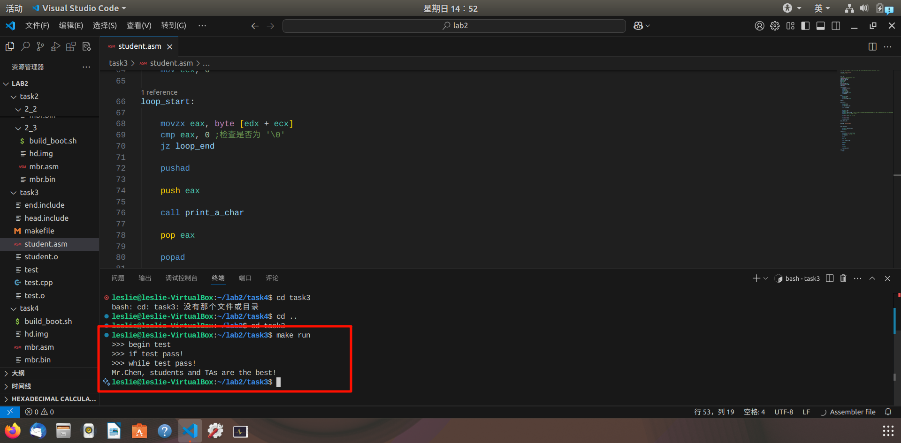
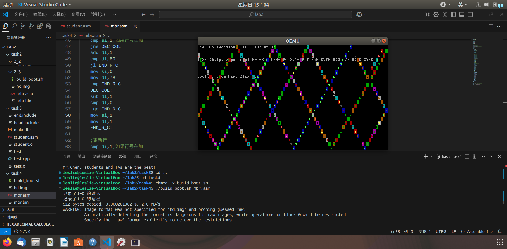
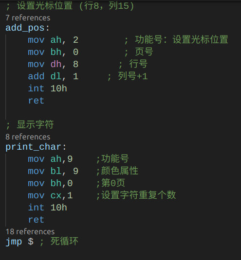
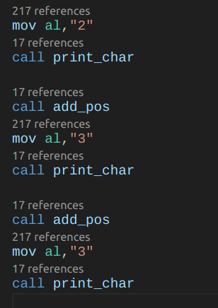

### 一、实验要求
- 在 MBR 被加载后，将字符正确显示在屏幕上
- 利用实模式下的中断，移动光标的位置并输出内容，包括任意键盘输入并回显
- 利用汇编语言实现分支逻辑、循环逻辑以及函数的编写并测试
- 编写汇编小程序（字符弹射程序）
### 二、实验过程
#### 1. 任务 1 - MBR
##### 1.1 复现 Example 1
- 使用 nasm 汇编器将代码编译成二进制文件，创建虚拟磁盘并将 MBR 写入，然后启动 qemu 模拟计算机启动
    
##### 1.2 修改代码实现新功能
- 修改光标位置，要求从 (12,12) 位置处输出学号 (23336050)
- 修改代码颜色为“白色底黑色字”
- 光标 (12,12) 位置，则起始位置为：$2*(12 \times 80 \ + 12)$ 
    ```nasm
    mov ah, 0x70 ;白色底黑色字
    mov al, '2'
    mov [gs:2 * 972], ax
    ```
- 结果截图：
    
#### 2. 任务 2 - 实模式中断
##### 2.1 实现将光标移动至(8,8)，获取并输出光标的位置
- 首先实现将光标位置移动至 (8,8)，这里利用功能号 $2$ 和中断 `int 10h`便能实现，关键代码如下
    ```nasm
    mov ah,2 ;功能号
    mov bh,0 ;第0页
    mov dh,8 ;dh中放行号8
    mov dl,8 ;dl中放列号8
    int 10h
    ```
    
- 然后如何获取并输出光标的位置呢？光标的位置可以从 dh 和 dl 寄存器中获取，输出则仿照 [任务 1](#1-任务-1---mbr) 的输出方式（这里设定开始输出坐标为 (0,0)），于是：
  - 部分代码：
    ```nasm
    ...
    mov ah, 0x70 ;白底黑字
    mov al, '('
    mov [gs:2 * 0], ax

    mov al, dh
    add al, '0'
    mov [gs:2 * 1], ax
    ...
    ```
  - 结果截图
    
##### 2.2 利用实模式下的中断，从(8,8)开始输出学号
- 实现思路：先将光标移动到 (8,8) 位置，每输出字符后，移动光标 + 1
  - 移动光标位置代码：
    ```nasm
    mov ah, 2 
    mov bh, 0 
    mov dh, 8 ;行号
    add dl, 1 ;列号 + 1
    int 10h
    ```
  - 输出字符代码：
    ```nasm
    mov ah,9 ;功能号
    mov al,"2" ;字符
    mov bl,9 
    mov bh,0 
    mov cx,1 
    int 10h
    ```  
- 结果截图：
    
##### 2.3 利用键盘中断，实现任意键盘输入并回显的效果
- 实现思路：在循环前先设置光标位置为 (0,0) ，在循环内：利用中断`int 16h`从键盘读取字符，再利用功能号 $9$ 以及中断`int 10h`显示对应读取到的字符。接着进行行号和列号的更新，逻辑如下：（边界检查）
    ```
    //列更新
    if col < 80
        col += 1
    else
        row += 1
        col = 0
    //行更新
    if row < 25
        continue
    else
        row = 0
    ```
    另外，循环退出的条件是检测到键盘按下了 `Esc` 键。
  - 设置光标位置同上
  - 检测是否键入 `Esc` 代码：
      ```nasm
      ...
          cmp al,0x1b
          je END_
      ...
      ```
  - 获取键盘输入并打印代码
      ```nasm
      ···
          mov ah,0
          int 16h ;中断

          ...

          ;显示字符
          mov ah,9    
          mov bl,7 
          mov bh,0  
          mov cx,1 
          int 10h
      ...
      ```
  - 判断逻辑部分代码
      ```nasm
          ;循环的标号为 PRINT
          add dl,1
          cmp dl,80
          jle PRINT ;如果dl < 80, 则继续打印
          add dh,1
          mov dl,0
          cmp dh,25
          jle PRINT ;如果dh < 25, 则继续打印
          mov dh,0
          mov dl,0
          jmp PRINT
      ```
- 结果截图
    
#### 3. 任务 3 - 汇编
##### 3.1 分支逻辑的实现
- 按照分支逻辑从上到下编写逻辑，利用跳转指令实现分支跳转
- 注意分支逻辑的跳转条件以及关系
- 在做除法运算的时候注意商与余数存放的寄存器名称
- 代码解释见 [三、关键代码](#三-关键代码)
##### 3.2 循环逻辑的实现
- 代码：
    ```nasm
    your_while:
        mov eax,[a2]
        cmp eax, 12
        jl your_while_end   

        call my_random       

        mov ecx, [a2]
        sub ecx, 12          
        mov edx, [while_flag] 
        add edx, ecx;计算出地址放在edx中         

        mov byte [edx], al;一个字节  

        dec dword [a2]

        jmp your_while

    your_while_end:
    ```
- 在计算`while_flag`的地址的时候，将 `a2` 的值存储在新的寄存器，这样就可以直接对 `a2` 递减，而不用多一步加上 12
- 其他解释见 [三、关键代码](#三-关键代码)
##### 3.3 函数的实现
- 代码：
    ```nasm
    your_function:
        mov edx, [your_string]    
        mov ecx, 0 

    loop_start:
        movzx eax, byte [edx + ecx]  
        cmp eax, 0 ;检查是否为 '\0'
        jz loop_end
        
        pushad
        
        push eax
        
        call print_a_char
        
        pop eax
        
        popad
        
        inc ecx
        
        jmp loop_start
        
    loop_end:
        ret
    ```
- `movzx` 实现零扩展，以存放在 32 位寄存器里面
- 循环开始前将 `your_string` 的地址放在 `edx` 寄存器里，设置 `ecx` 作为  $i$  进行递增
- 循环跳出的条件是到达字符串结尾 `cmp eax, 0`
##### 3.4 结果截图

#### 4. 任务 4 - 汇编小程序
- 实现思路：在已经有判断是否到达边界的逻辑判断，于是稍加修改：1. 同时递增或递减行和列（实现 $45^。$角反弹）2. 新增两个寄存器分别存储行与列处于递增还是处于递减状态
- 部分代码：
  - 两个记录递增或递减状态的寄存器：
    ```nasm
    mov si,1;表示行号在加
    mov di,1;表示列号在加
    ```
  - 实现随机颜色显示：
    ```nasm
    mov byte [seed], 42  ; 初始种子值

    ...

        ;生成随机颜色
        mov cl, [seed] 
        mov bl, cl  
        shl bl, 3       
        xor bl, cl       
        add bl, dh      
        add bl, dl   
        and bl, 0x7F;保证在颜色显示范围内    
        mov [seed], bl  

    ...

    seed: db 42 ;存储随机种子的变量

    ...
    ```
  - 列的更新：
    ```nasm
    ;更新列
    cmp si,1;如果行号在加
    jne DEC_COL
    add dl,1
    cmp dl,80
    jl END_R_C
    mov si,0
    mov dl,78
    jmp END_R_C
    DEC_COL:
        sub dl,1
        cmp dl,0
        jge END_R_C
        mov si,1
        mov dl,1

    END_R_C:
    ```
- 结果截图：
    
### 三、关键代码
#### 1. 将重复代码统一：
- 在 [2.2](#22-利用实模式下的中断从88开始输出学号) 中打印学号时，每次的打印与光标更新都是重复的，故考虑使用函数将重复的代码统一：
    
- 那么在调用的时候就简洁很多：
    
#### 2. 分支逻辑代码解释 [LINK - 3.1](#31-分支逻辑的实现)
```nasm
your_if:
; put your implementation here
cmp dword [a1],12
jge less_then_24
mov eax,[a1]
mov ecx,2
idiv ecx
mov [if_flag],eax 
inc dword [if_flag]
jmp end_if

less_then_24:
    cmp dword [a1],24
    jge else_ 
    mov ecx,24
    sub ecx,[a1]    
    imul ecx,[a1]
    mov [if_flag], ecx
    jmp end_if

else_:
    mov eax,[a1]
    shl eax,4
    mov [if_flag], eax

end_if:
```
- 在 [test.cpp]() 代码中可以看到声明：
    ```cpp
    int if_flag, a1, a2;
    ```
    因此这三个变量都是 32 位的，因此在 `cmp` 或者 `inc` 的时候都要加上 `dword` 四个字节，并且使用 32 位寄存器存储它们的信息
- "[ ]"问题：
    注意到`[if_flag]` , `a1` 和 `a2` 都需要加上 "[ ]" ,以确保 `[***]`是在获取这个指针变量存储的地址值，也就是它指向的内存位置，而不是指针变量本身的地址
#### 3. 循环逻辑代码解释 [LINK - 3.2](#32-循环逻辑的实现)
- `mov byte [edx], al` 已知 my_random 函数返回的随机数存放在 exa 寄存器中，但是只能存储一字节的到 while_flag 的指定位置，所以采用的是 exa 寄存器的低 8 位 al
### 四、总结
- 在编写汇编代码时，由于只能采用跳转来实现分支逻辑，故一开始遇到了很多逻辑上的错误，不过能跑通一个也知道其他的应该怎么写了。
- 在很多地方，由于一开始没有注意寄存器的位数不同，导致许多 nasm 代码编译不过。因此：在使用寄存器和变量的时候要了解及正确匹配位数。
- 一开始做 [3.3](#33-函数的实现) 的时候，忘记把 your_string 加上 "[ ]"，导致最后打印的那句 <font color = brown>“Mr.Chen, students and TAs are the best!\n”</font> 时总是乱码，debug 了很久。
- 另外，学会了使用函数调用来减少重复代码
- 汇编代码要深入学习熟悉。