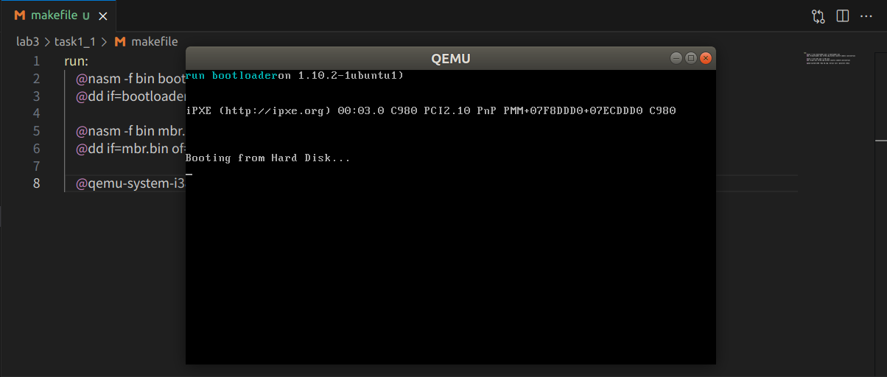

## 📌 目录
- [一、实验要求](#一实验要求)
- [二、实验过程](#二实验过程)
- [1. 任务 1](#1-任务-1)
    - [1.1 复现 Example 1：bootloader的加载](#11-复现-example-1bootloader的加载)
    - [1.2 使用 CHS 模式读取硬盘](#12-使用-chs-模式读取硬盘)
- [2. 任务 2](#2-任务-2)
    - [调试前置工作](#调试前置工作)
    - [开始正式调试](#开始正式调试)
- [3. 任务 3](#3-任务-3)
- [三、关键代码](#三关键代码)
    - [使用 CHS 模式读取硬盘 关键代码](#使用-chs-模式读取硬盘-关键代码)
- [四、总结](#四总结)

---

### 一、实验要求
- 学习如何从 $16$ 位的实模式跳转到 $32$ 位的保护模式，然后在**平坦模式**下运行 $32$ 位程序。
- 学习如何使用 $I/O$ 端口和硬件交互
### 二、实验过程
#### 1. 任务 1 
##### 1.1 复现 Example 1：bootloader的加载
- 划分区域：
    |    name    | start  |     length      |  end   |
    | :--------: | :----: | :-------------: | :----: |
    |    MBR     | 0x7c00 |   0x200(512B)   | 0x7e00 |
    | bootloader | 0x7e00 | 0xa00(512B * 5) | 0x8800 |
- 使用 `git clone` 克隆项目文件夹到本地
  - `mbr.asm`：使用 LBA 模式读取硬盘代码，然后加载 `bootloader` 到地址 `0x7e00` 处
  - `bootloader.asm`：实现打印字符 <font color = 0x00A8A8> run bootloader </font> 
- 编写 `makefile` 文件
  
- 在终端输入 `make run` 运行代码
  
##### 1.2 使用 CHS 模式读取硬盘
- LBA 与 CHS 对比
    |         |                               逻辑扇区读取                               |                         端口读取                          |
    | :-----: | :----------------------------------------------------------------------: | :-------------------------------------------------------: |
    | **LBA** |                          只要给出逻辑扇区号即可                          |                  但需要手动去读取I/O端口                  |
    | **CHS** | 需要给出逻辑扇区号对应的磁头（Heads）、扇区（Sectors）和柱面（Cylinder） | BIOS提供了实模式下读取硬盘的中断，不需要关心具体的I/O端口 |
- 给出 LBA 到 CHS 的转换公式：
    - 关键参数：
        | 参数                                      | 数值 |
        | ----------------------------------------- | ---- |
        | 驱动器号（DL寄存器）                      | 80h  |
        | 每磁道扇区数 （Sectors）                  | 63   |
        | 每柱面磁头数（每柱面总的磁道数）（Heads） | 18   |
    - 寄存器信息
        
    - 公式：
        - 柱面号
            ```math 
            Cylinder = LBA / (Heads * Sectors)
            ``` 
        - 磁头号
            ```math 
            Head = (LBA / Sectors) \% Heads
            ```
        - 扇区号
            ```math 
            Sector = (LBA \% Sectors) + 1
            ```
        
- 实现代码见 [关键代码](#三-关键代码)
- 实验结果：
    
#### 2. 任务 2
- 复现 Example 2，使用 gdb 工具在进入保护模式的 4 个重要步骤上设置断点：
  -  **准备GDT，用lgdt指令加载GDTR信息**。
  -  **打开第21根地址线**。
  - **开启cr0的保护模式标志位**。
  - **远跳转，进入保护模式**。 
###### 调试前置工作
- 在`bootloder`起始位置设置断点：
  
- 加载`bootloder.asm` 的符号表
  
- 在四个关键步骤设置断点：
  
###### 开始正式调试
- 查看`pdgt`是否正确加载【注意从左到右为低地址到高地址】
  - 由于`pdgt`是 $48 bit$ 的，所以查看命令为：`x/6xb pgdt` 
    
    观察到与`GDT_START_ADDRESS`的设定值匹配
  - 加载`pdgt`低 $16bit$ 的值（`mov word [pgdt], 39`）后再观察：
    
    `0x27` 即十进制 $39$
- 打开第  $21$ 根地址线：设置端口值 `bit 1`位置的值为 $1$，开启 A20 
  - 执行
    ```NASM
    in al,0x92                         
    or al,0000_0010B
    out 0x92,al                  
    ```
    
    观察到`bit 1`位置的值为 $1$，即开启成功
- PE 置 1：设置`CR0`的 `bit 0` 位为 $1$，开启保护模式
  - 修改前：
    
  - 修改后：
    
- 远跳转进入保护模式：
  - 查看`cs`寄存器的值：
    
    与 `CODE_SELECTOR` 的值一致
  - 查看`eip`寄存器的值：
    
    观察到`eip`寄存器的值为`protect_mode_begin + LOADER_START_ADDRESS`
- 至此成功进入保护模式
#### 3. 任务 3
- 改造 “Lab2 - Assignment 4” 为 32 位代码，即在保护模式后执行字符弹射汇编程序。
- 上个实验的 task - 4 实现：
    > - 实现思路：在已经有判断是否到达边界的逻辑判断，于是稍加修改：1. 同时递增或递减行和列（实现 $45^。$角反弹）2. 新增两个寄存器分别存储行与列处于递增还是处于递减状态
    > - 部分代码：  
    >   - 两个记录递增或递减状态的寄存器：  
    >     ```nasm  
    >     mov si,1;表示行号在加  
    >     mov di,1;表示列号在加  
    >     ```  
    >   - 实现随机颜色显示：  
    >     ```nasm  
    >     mov byte [seed], 42  ; 初始种子值  
    >  
    >     ...  
    >  
    >         ;生成随机颜色  
    >         mov cl, [seed]  
    >         mov bl, cl  
    >         shl bl, 3       
    >         xor bl, cl       
    >         add bl, dh      
    >         add bl, dl   
    >         and bl, 0x7F;保证在颜色显示范围内    
    >         mov [seed], bl  
    >  
    >     ...  
    >  
    >     seed: db 42 ;存储随机种子的变量  
    >  
    >     ...  
    >     ```  
    >   - 列的更新：  
    >     ```nasm  
    >     ;更新列  
    >     cmp si,1;如果行号在加  
    >     jne DEC_COL  
    >     add dl,1  
    >     cmp dl,80  
    >     jl END_R_C  
    >     mov si,0  
    >     mov dl,78  
    >     jmp END_R_C  
    >     DEC_COL:  
    >         sub dl,1  
    >         cmp dl,0  
    >         jge END_R_C  
    >         mov si,1  
    >         mov dl,1  
    >  
    >     END_R_C:  
    >     ```  
- 上个实验的代码是利用 BIOS 中断读取键盘输入进行字符显示（也就是有输入字符才会显现）
- 然而由于保护模式中所有 BIOS 中断都不可用，且如果要读取键盘输入则需要读取键盘控制器端口（`0x60/0x64`）
- 💡所以本实验在上次实验的基础上进行修改：
  - 所有寄存器 32 位化
  - 直接在屏幕上显示字符  $(A - Z)$（不需要输入）
  - 循环显示字符
  - 增加 `DELAY` 循环控制字符显示速度
- 修改代码：
  - 寄存器 32 位化：
    ```nasm
    ...
    mov esi, 1       ; 表示行号在加
    mov edi, 1       ; 表示列号在加
    ...
    ```
  - 随机字符生成：
      ```nasm
      ...
      ; 随机字符 (A-Z)
          and cl, 0x1F    ; 保留低5位
          add cl, 'A'      ; 转换为字母
          cmp cl, 'Z'+1    ; 确保在A-Z范围内
          jl valid_char
          sub cl, 26       ; 如果超出范围，回到A-Z范围内
      valid_char:
          mov al, cl   
      ...
      ```
  - 直接在屏幕显示字符
    - 计算屏幕偏移位置：
    ```nasm
    ...
    movzx ebx, dh
    imul ebx, 80  ; 行 * 80
    movzx ecx, dl
    add ebx, ecx  ; + 列
    shl ebx, 1    ; * 2 (每个字符占用2字节)

    ...
    
     ; 写入显存
    mov word [gs:ebx], ax
    ...
    ```
  - 增加 `DELAY` 循环控制字符显示速度
    ```nasm
    ; 延迟
    ...
        mov ecx, 0x1000000  ; 调整这个值以控制速度
    DELAY:
        loop DELAY
    ...
    ```
  - 完整代码
    ```nasm
    %include "boot.inc"
    
    [bits 16]
    mov ax, 0xb800
    mov gs, ax

    ;空描述符
    mov dword [GDT_START_ADDRESS+0x00],0x00
    mov dword [GDT_START_ADDRESS+0x04],0x00  

    ;创建描述符，这是一个数据段，对应0~4GB的线性地址空间
    mov dword [GDT_START_ADDRESS+0x08],0x0000ffff    ; 基地址为0，段界限为0xFFFFF
    mov dword [GDT_START_ADDRESS+0x0c],0x00cf9200    ; 粒度为4KB，存储器段描述符 

    ;建立保护模式下的堆栈段描述符      
    mov dword [GDT_START_ADDRESS+0x10],0x00000000    ; 基地址为0x00000000，界限0x0 
    mov dword [GDT_START_ADDRESS+0x14],0x00409600    ; 粒度为1个字节

    ;建立保护模式下的显存描述符   
    mov dword [GDT_START_ADDRESS+0x18],0x80007fff    ; 基地址为0x000B8000，界限0x07FFF 
    mov dword [GDT_START_ADDRESS+0x1c],0x0040920b    ; 粒度为字节

    ;创建保护模式下平坦模式代码段描述符
    mov dword [GDT_START_ADDRESS+0x20],0x0000ffff    ; 基地址为0，段界限为0xFFFFF
    mov dword [GDT_START_ADDRESS+0x24],0x00cf9800    ; 粒度为4kb，代码段描述符 

    ;初始化描述符表寄存器GDTR
    mov word [pgdt], 39      ;描述符表的界限   
    lgdt [pgdt]
        
    in al,0x92                         ;南桥芯片内的端口 
    or al,0000_0010B
    out 0x92,al                        ;打开A20

    cli                                ;中断机制尚未工作
    mov eax,cr0
    or eax,1
    mov cr0,eax                        ;设置PE位
        
    ;以下进入保护模式
    jmp dword CODE_SELECTOR:protect_mode_begin

    ;16位的描述符选择子：32位偏移
    ;清流水线并串行化处理器
    [bits 32]           
    protect_mode_begin:                              

    mov eax, DATA_SELECTOR                     ;加载数据段(0..4GB)选择子
    mov ds, eax
    mov es, eax
    mov eax, STACK_SELECTOR
    mov ss, eax
    mov eax, VIDEO_SELECTOR
    mov gs, eax

    ;这里开始
    mov esi, 1       ; 表示行号在加
    mov edi, 1       ; 表示列号在加
    mov byte [seed], 42  ; 初始种子值

    mov dl, 0        ; 列号
    mov dh, 2        ; 行号
    mov ah, 0x07     ; 颜色属性

    PLAY:
        ; 计算屏幕偏移
        movzx ebx, dh
        imul ebx, 80  ; 行 * 80
        movzx ecx, dl
        add ebx, ecx  ; + 列
        shl ebx, 1    ; * 2 (每个字符占用2字节)

        ; 生成随机颜色和字符
        mov cl, [seed]
        
        ; 更新随机种子
        shl cl, 3    
        xor cl, [seed]   
        add cl, dh   
        add cl, dl   
        mov [seed], cl
        
        ; 随机字符 (A-Z)
        and cl, 0x1F    ; 保留低5位
        add cl, 'A'      ; 转换为字母
        cmp cl, 'Z'+1    ; 确保在A-Z范围内
        jl valid_char
        sub cl, 26       ; 如果超出范围，回到A-Z范围内
    valid_char:
        mov al, cl   
        
        ; 随机颜色
        mov cl, [seed]
        mov ah, cl      
        and ah, 0x0F     ; 保留低4位
        
        rol cl, 4 ;旋转随机数
        and cl, 0x07 ;限制为0-7
        shl cl, 4 
        or ah, cl ;合并颜色

        ; 写入显存
        mov word [gs:ebx], ax

        ; 更新列位置
        cmp esi, 1    ; 如果列号在加
        jne DEC_COL
        add dl, 1
        cmp dl, 80
        jl END_R_C
        mov esi, 0
        mov dl, 78
        jmp END_R_C
    DEC_COL:
        sub dl, 1
        cmp dl, 0
        jge END_R_C
        mov esi, 1
        mov dl, 1
    END_R_C:

        ; 更新行位置
        cmp edi, 1    ; 如果行号在加
        jne DEC_ROW
        add dh, 1
        cmp dh, 25
        jl END_R_R
        mov edi, 0
        mov dh, 23
        jmp END_R_R
    DEC_ROW:
        sub dh, 1
        cmp dh, 0
        jge END_R_R
        mov edi, 1
        mov dh, 1
    END_R_R:

        ; 延迟
        mov ecx, 0x1000000  ; 调整这个值以控制速度
    DELAY:
        loop DELAY

        jmp PLAY

    seed: db 42    ; 存储随机种子的变量
    ;这里结束

    jmp $ ; 死循环

    pgdt dw 0
        dd GDT_START_ADDRESS


    ```
  
### 三、关键代码
##### [使用 CHS 模式读取硬盘](#12-使用-chs-模式读取硬盘) 关键代码
- 只需要在 Example 1 的代码中修改`asm_read_hard_disk:` 部分，以及在读取循环中添加 `add bx, 512 ;增加缓冲区指针`
- `asm_read_hard_disk:` 部分结构：
    ```
    ├── 保存寄存器
    ├── 计算扇区号
    ├── 计算磁头号和扇区号
    │   ├── 计算磁头号
    │   └── 计算扇区号
    ├── 调用 BIOS中断读取硬盘
    ├── 恢复寄存器
    ```  
- 代码：
    - 计算扇区号：
        ```nasm
        ; 计算扇区号 (S) = (LBA % 63) + 1
        xor dx, dx
        mov cx, 63          ; 每磁道扇区数
        idiv cx              ; ax / cx，商在ax，余数在dx
        inc dx              ; 扇区号从1开始
        mov cl, dl          ; CL的低6位 = 扇区号(1-63)
        ```
    - 计算磁头号和扇区号
        ```nasm
        ; 计算磁头号(H) = (LBA / 63) % 18 和 柱面号(C) = (LBA / 63) / 18
        xor dx, dx
        mov di, 18          ; 每柱面磁头数
        idiv di             ; ax / cx，商在ax (柱面号)，余数在dx (磁头号)

        mov ch, al          ; CH = 柱面号的低8位
        mov dh, dl          ; DH = 磁头号
        mov dl, 80h         ; DL = 驱动器号 
        ```
    - 调用 BIOS 中断读取硬盘
        ```nasm
        mov al,1        ;AL = 读取1个扇区
        mov ah, 2h       ; AH = 02h (读取扇区功能),
        int 13h             ; 调用BIOS中断
        ```
    - 完整代码
        ```nasm
        
        [bits 16]
        xor ax, ax ; eax = 0
        ; 初始化段寄存器, 段地址全部设为0
        mov ds, ax
        mov ss, ax
        mov es, ax
        mov fs, ax
        mov gs, ax

        ; 初始化栈指针
        mov sp, 0x7c00
        mov ax, 1                ; 逻辑扇区号第0~15位
        mov cx, 0                ; 逻辑扇区号第16~31位
        mov bx, 0x7e00           ; bootloader的加载地址
        load_bootloader:
            call asm_read_hard_disk  ; 读取硬盘
            add bx, 512         ; 增加缓冲区指针
            inc ax
            cmp ax, 5
            jle load_bootloader
        jmp 0x0000:0x7e00        ; 跳转到bootloader

        jmp $ ; 死循环

        asm_read_hard_disk:                           
        ; 从硬盘读取一个逻辑扇区，使用CHS模式和BIOS中断13h

        ; 参数列表
        ; ax=逻辑扇区号0~15位
        ; cx=逻辑扇区号16~28位 (在当前实现中假设为0)
        ; ds:bx=读取出的数据放入地址

        ; 返回值
        ; bx=bx+512

            ;保存寄存器
            push ax
            push cx
            push dx
            
            ; 计算扇区号 (S) = (LBA % 63) + 1
            xor dx, dx
            mov cx, 63          ; 每磁道扇区数
            idiv cx              ; ax / cx，商在ax，余数在dx
            inc dx              ; 扇区号从1开始
            mov cl, dl          ; CL的低6位 = 扇区号(1-63)

            ; 计算磁头号(H) = (LBA / 63) % 18 和 柱面号(C) = (LBA / 63) / 18
            xor dx, dx
            mov di, 18          ; 每柱面磁头数
            idiv di             ; ax / cx，商在ax (柱面号)，余数在dx (磁头号)

            mov ch, al          ; CH = 柱面号的低8位
            mov dh, dl          ; DH = 磁头号
            mov dl, 80h         ; DL = 驱动器号 
            
            mov al,1        ;AL = 读取1个扇区
            mov ah, 2h       ; AH = 02h (读取扇区功能),
            int 13h             ; 调用BIOS中断


            ;恢复寄存器
            pop dx
            pop cx
            pop ax
            ret

        times 510 - ($ - $$) db 0
        db 0x55, 0xaa
        ```
### 四、总结
- 学会了如何从 $16$ 位的实模式跳转到 $32$ 位的保护模式，然后在**平坦模式**下运行
- 学会了利用 `in` 和 `out` 指令与硬件端口交互
- 学会了如何使用 `gdb` 调试程序
- 学会了编写 `makefile` 文件简化工作流程
- 对汇编代码更加熟悉
- 实验难点主要在于对代码的理解以及对从实模式到保护模式的转化的理解
