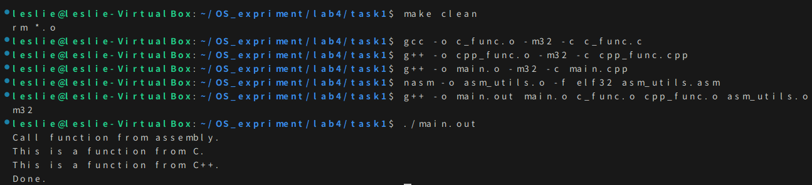
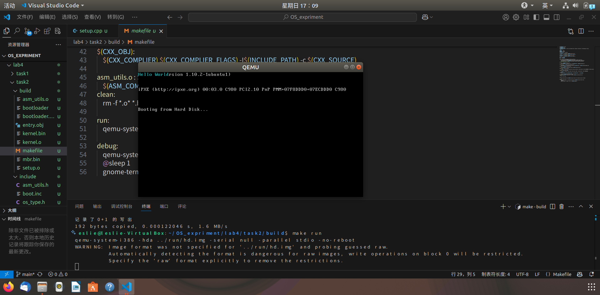
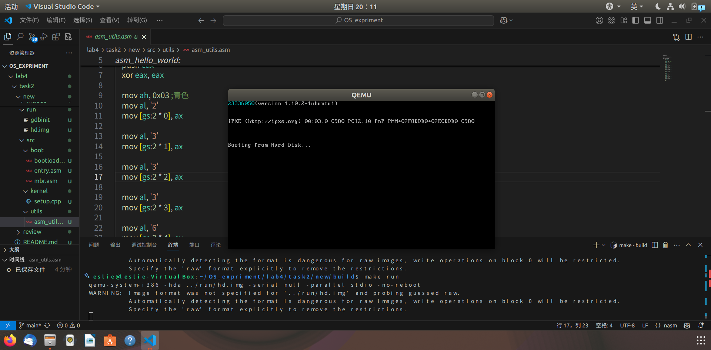
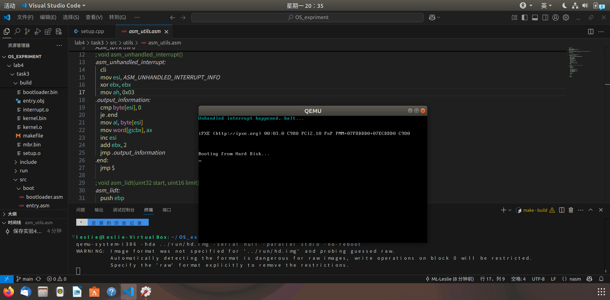
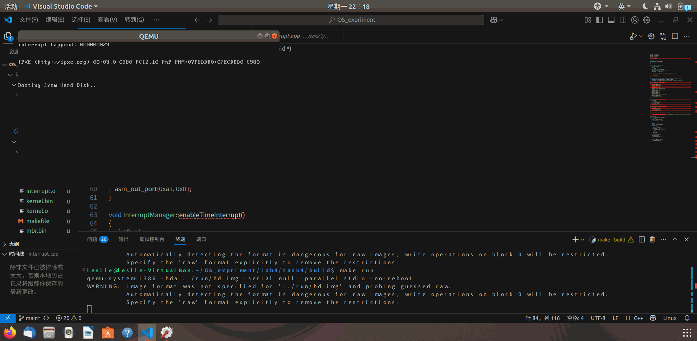
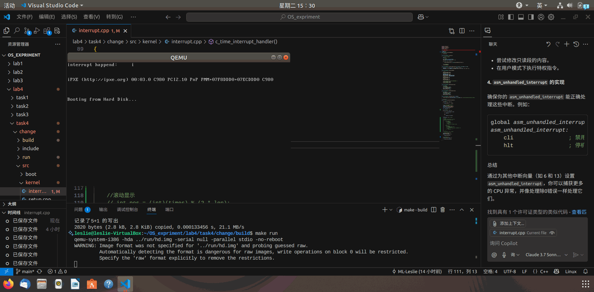
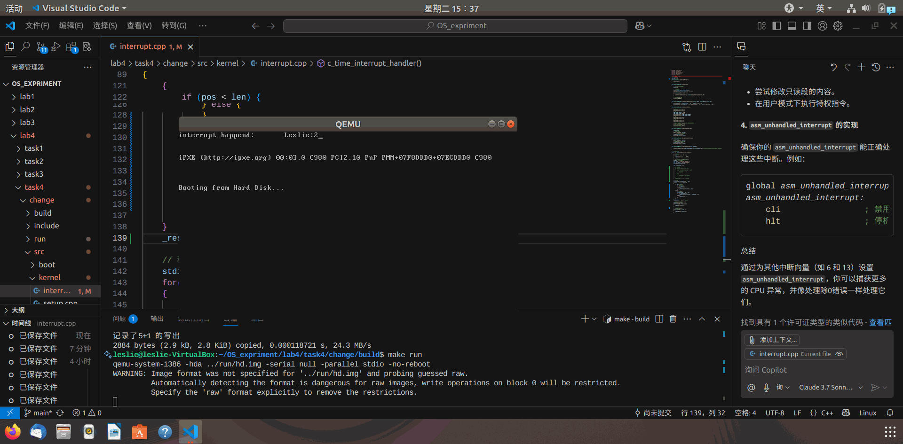

## 📌 目录
- [📌 目录](#-目录)
  - [一、实验要求](#一实验要求)
  - [二、实验过程\&结果](#二实验过程结果)
    - [Assignment 1 混合编程的基本思路](#assignment-1-混合编程的基本思路)
      - [1. 解释 Example 1 代码](#1-解释-example-1-代码)
      - [2. 编译和链接](#2-编译和链接)
      - [3. 编写 Makefile](#3-编写-makefile)
    - [Assignment 2 使用C/C++来编写内核](#assignment-2-使用cc来编写内核)
      - [复现 Example 2 代码并实现](#复现-example-2-代码并实现)
      - [修改为输出学号（23336050）](#修改为输出学号23336050)
    - [Assignment 3 中断的处理](#assignment-3-中断的处理)
      - [阅读代码时一些理解记录](#阅读代码时一些理解记录)
      - [实验结果](#实验结果)
    - [Assignment 4 时钟中断](#assignment-4-时钟中断)
      - [示例实验结果【GIF】](#示例实验结果gif)
      - [修改代码更改中断输出](#修改代码更改中断输出)
        - [1. "Leslie:23336050" 跑马灯](#1-leslie23336050-跑马灯)
        - [2. "Leslie:23336050" 横向滚动显示](#2-leslie23336050-横向滚动显示)
  - [三、关键代码](#三关键代码)
  - [四、总结](#四总结)
---

### 一、实验要求
- C 代码变成 C 程序的过程。
- C/C++ 项目的组织方法。
- makefile 的使用。
- C 和汇编混合编程。
- 保护模式中断处理机制。
- 8259A 可编程中断处理部件。
- 时钟中断的处理。
### 二、实验过程&结果
#### Assignment 1 混合编程的基本思路
##### 1. 解释 Example 1 代码
- `asm_utils.asm`：
    ```nasm
    [bits 32]
    global function_from_asm
    extern function_from_C
    extern function_from_CPP

    function_from_asm:
        call function_from_C
        call function_from_CPP
        ret
    ```
  - `global`：声明函数 `function_from_asm` 为全局可见。
  - `extern`：声明函数 `function_from_C` 和 `function_from_CPP` 为外部函数。
- `c_func.c`：
    ```c
    #include <stdio.h>
    void function_from_C() {
        printf("This is a function from C.\n");
    }
    ```
  - `function_from_C`：C 语言函数，打印 `"This is a function from C."`
- `cpp_func.cpp`：
    ```cpp
    #include <iostream>

    extern "C" void function_from_CPP() {
        std::cout << "This is a function from C++." << std::endl;
    }
    ```
  - `extend "C"`：告诉编译器使用 C 语言的链接方式，避免 C++ 的名称修饰。保持在汇编语言中标号的名称一致。
##### 2. 编译和链接
- 由于需要 32 支持库
  - 在终端执行以下命令：
    ```bash
    sudo apt install g++-multilib
    ```
- 然后在终端执行以下命令：
    ```bash
    gcc -o c_func.o -m32 -c c_func.c
    g++ -o cpp_func.o -m32 -c cpp_func.cpp 
    g++ -o main.o -m32 -c main.cpp
    nasm -o asm_utils.o -f elf32 asm_utils.asm
    g++ -o main.out main.o c_func.o cpp_func.o asm_utils.o -m32
    ```
    - 分别将 C、C++ 和汇编代码编译成可重定位文件。（先不链接）
    - `-m32`：编译成 32 位可执行文件。
    - 最后将所有可重定位文件链接成一个可执行文件 `main.out`。
- 执行 `main.out`：  
    
    - 观察到正确的输出结果
##### 3. 编写 Makefile
- `Makefile`：
    ```makefile
    c_func.o: c_func.c
	gcc -o c_func.o -m32 -c c_func.c

    cpp_func.o: cpp_func.cpp
        g++ -o cpp_func.o -m32 -c cpp_func.cpp 

    main.o: main.cpp
        g++ -o main.o -m32 -c main.cpp

    asm_func.o: asm_func.asm
        nasm -o asm_func.o -f elf32 asm_func.asm

    main.out: main.o c_func.o cpp_func.o asm_func.o
        g++ -o main.out main.o c_func.o cpp_func.o asm_func.o -m32

    clean:
        rm *.o
    ```
    - 基本语法结构：
        ```makefile
        目标: 依赖
        命令
        ```
- 尝试运行 `make`：  
    
#### Assignment 2 使用C/C++来编写内核
##### 复现 Example 2 代码并实现
- `makefile`部分代码解释：
    ```makefile
    CXX_SOURCE += $(wildcard $(SRCDIR)/kernel/*.cpp)
    CXX_OBJ += $(CXX_SOURCE:$(SRCDIR)/kernel/%.cpp=%.o)
    ```
    - 第一行：
      - `$(wildcard pattern)`：是 GNU Make 的一个函数，用于匹配文件名
      - 所以整体的意思是：在 `$(SRCDIR)/kernel/` 目录下查找所有的 `.cpp` 文件，并将它们存储在 `CXX_SOURCE` 变量中。
    - 第二行：
      - 使用了 `GUN` 的模式替换语法
        ```makefile
        $(变量:模式=替换)
        ```
      - 所以整体意思是：把 `CXX_SOURCE` 里的每个 `src/kernel/xxx.cpp` 替换为 `xxx.o`，赋值给 `CXX_OBJ`
- 实现：
  - 在终端执行：
    ```bash
    make
    make run
    ```
  - 运行结果：
    
##### 修改为输出学号（23336050）
- 修改 `asm_utils.asm`：
    ```nasm
    [bits 32]

    global asm_hello_world

    asm_hello_world:
        push eax
        xor eax, eax

        mov ah, 0x03 ;青色
        mov al, '2'
        mov [gs:2 * 0], ax

        mov al, '3'
        mov [gs:2 * 1], ax

        mov al, '3'
        mov [gs:2 * 2], ax

        mov al, '3'
        mov [gs:2 * 3], ax

        mov al, '6'
        mov [gs:2 * 4], ax

        mov al, '0 '
        mov [gs:2 * 5], ax

        mov al, '5'
        mov [gs:2 * 6], ax

        mov al, '0'
        mov [gs:2 * 7], ax

        pop eax
        ret
    ```
- 输出结果：
  
#### Assignment 3 中断的处理
##### 阅读代码时一些理解记录
- `asm_utils.asm`：
    ```nasm
    ; void asm_lidt(uint32 start, uint16 limit)
    asm_lidt:
        push ebp
        mov ebp, esp
        push eax

        mov eax, [ebp + 4 * 3]
        mov [ASM_IDTR], ax
        mov eax, [ebp + 4 * 2]
        mov [ASM_IDTR + 2], eax
        lidt [ASM_IDTR]

        pop eax
        pop ebp
        ret
    ```
    - 前面三行作用是：设置标准栈帧。
      - 先`push`保存上一个函数的 ebp（调用者的栈帧基址）
      - 把当前函数的栈帧基址 ebp 设置为esp（当前栈顶）
      - `push eax`：保存 eax 寄存器的值。
    - 所以此时的栈结构变为：
        ```cssharp
        [ebp + 0]    -> 上一个函数的ebp（调用者的栈帧基址）
        [ebp + 4]    -> 返回地址（ret用）
        [ebp + 8]    -> 第一个参数
        [ebp + 12]   -> 第二个参数
        ```
    - lidt要求的数据结构如下：
        ```
        struct {
            uint16 limit;
            uint32 base;
        }
        ```
        - 所以先写入 limit ，再写入 start
##### 实验结果
- 在终端执行：
  ```bash
  make
  make run
  ```
- 
#### Assignment 4 时钟中断
##### 示例实验结果【GIF】
  
##### 修改代码更改中断输出
###### 1. "Leslie:23336050" 跑马灯
- 修改 `./src/kernel/interrupt.cpp` 中的 `extern "C" void c_time_interrupt_handler()` 函数
  - 代码：
    ```cpp
    // 中断处理函数
    extern "C" void c_time_interrupt_handler()
    {
        // 清空屏幕
        for (int i = 0; i < 80; ++i)
        {
            stdio.print(0, i, ' ', 0x07);
        }

        // 输出"Leslie:2336050"跑马灯效果
        ++times; //全局变量
        char str[] = "interrupt happend: ";
        char str_run[] = "Leslie:2336050";
        int len = sizeof(str_run) - 1;

        char _result[len + 1];

        //一个一个显示
        for (int i = 0; i < len; ++i)
        {
            if (i != ((int)(times/3) % len))
            {
                _result[i] = ' ';
            }
            else
            {
                _result[i] = str_run[i];
            }
        }
        _result[len] = '\0'; // 结束符

        // 移动光标到(0,0)输出字符
        stdio.moveCursor(0);
        for(int i = 0; str[i]; ++i ) 
        {
            stdio.print(str[i]);
        }
        
        // 跑马灯打印字符串
        for(int i = 0; i < len; ++i ) 
        {
            stdio.print(_result[i]);
        }
    }
    ```
    - 思路：
      - 先清空屏幕
      - 然后输出 `"interrupt happend: "`
      - 再输出 `"Leslie:2336050"`，每次中断时光标向右移动一个字符且只显示这个字符，形成跑马灯效果。
  - 实验结果【GIF】：
    
###### 2. "Leslie:23336050" 横向滚动显示
- 同样修改 `./src/kernel/interrupt.cpp` 中的 `extern "C" void c_time_interrupt_handler()` 函数
  - 代码：
    ```cpp
    // 中断处理函数
    extern "C" void c_time_interrupt_handler()
    {
        // 清空屏幕
        for (int i = 0; i < 80; ++i)
        {
            stdio.print(0, i, ' ', 0x07);
        }

        // 输出"Leslie:2336050"跑马灯效果
        ++times; //全局变量
        char str[] = "interrupt happend: ";
        char str_run[] = "Leslie:2336050";
        int len = sizeof(str_run) - 1;

        char _result[len + 1];

        //滚动显示
        int pos = (int)(times) % (2 * len);
        for (int i = 0; i < len; ++i)
        {
            if (pos < len) {
                // 消失的尾巴
                if (i < pos) {
                    _result[i] = ' ';
                } else {
                    _result[i] = str_run[i - pos];
                }
            } else {
                // 出现的头
                int actualPos = pos - len;
                if (i < actualPos) {
                    _result[i] = str_run[len - actualPos + i];
                } else {
                    _result[i] = ' ';
                }
            }
        }
        _result[len] = '\0'; // 结束符

        // 移动光标到(0,0)输出字符
        stdio.moveCursor(0);
        for(int i = 0; str[i]; ++i ) 
        {
            stdio.print(str[i]);
        }
        
        // 跑马灯打印字符串
        for(int i = 0; i < len; ++i ) 
        {
            stdio.print(_result[i]);
        }
    }
    ```
    - 思路：
      - 先清空屏幕
      - 由于要实现横向滚动显示，所以将 `times` 去模 `len` （字符串长度）的两倍
      - 如果 `pos` 小于 `len`，说明字符串右边在不断消失，左边的空格不断增多
      - 如果 `pos` 大于 `len`，说明字符串左边在不断出现，右边的空格不断减少
  - 实验结果【GIF】：
    
### 三、关键代码
- 需要修改的代码已经在 ↑ [二、实验过程&结果](#二实验过程结果) 中展示
### 四、总结
- 学习了一份代码是怎么变成程序的：经历了 预处理  $\to$  编译 $\to$ 汇编 $\to$ 链接 的过程。同时也学会了如何使用 `gcc` 和 `g++` 生成重定向文件以及进行链接。
- 学习了如何编写`makefile`，学习了`makefile`的基本语法和使用方法。能很好地提升工作效率
- 接着学习了 C/C++ 和汇编混合编程的相关知识，了解了为什么要在 `.asm` 文件中使用 `extern` 和 `global` 关键字，为什么要在 C++ 中使用 `extern "C"`的原因
- 学习了如何编写一个简单的保护模式下的中断处理程序，使用 C++ 编写中断类及触发除 0 错误的处理程序
- 学习了如何使用 8259A 可编程中断处理器，了解了它的工作原理和使用方法，在上一个任务的代码基础上增加了 `STDIO`类，使用 C++ 编写了字符显示函数。同时，在已有代码基础上，修改中断处理函数，实现跑马灯，滚动字符串等表示效果
