## 📌 目录
- [📌 目录](#-目录)
  - [一、实验要求](#一实验要求)
  - [二、实验过程\&关键代码](#二实验过程关键代码)
    - [Assignment 1 printf 的实现](#assignment-1-printf-的实现)
      - [1. 可变参数函数的实现](#1-可变参数函数的实现)
      - [2. 定义的几个宏的作用](#2-定义的几个宏的作用)
      - [3. 补充 `int printf(const char *const fmt, ...)` 函数更多实现](#3-补充-int-printfconst-char-const-fmt--函数更多实现)
        - [1. 添加代码以解析宽度和精度](#1-添加代码以解析宽度和精度)
        - [2. 增加对浮点数的支持](#2-增加对浮点数的支持)
        - [3. 增加对 8 进制的支持](#3-增加对-8-进制的支持)
        - [4. 增加对科学计数法的支持](#4-增加对科学计数法的支持)
    - [Assignment 2 线程的实现](#assignment-2-线程的实现)
      - [添加属性后的 PCB](#添加属性后的-pcb)
      - [添加到达时间 `arrivalTime`](#添加到达时间-arrivaltime)
      - [添加等待时间 `waitingTime`](#添加等待时间-waitingtime)
    - [Assignment 3 线程调度切换的秘密](#assignment-3-线程调度切换的秘密)
      - [调试查看线程调度切换的秘密](#调试查看线程调度切换的秘密)
    - [Assignment 4 调度算法的实现](#assignment-4-调度算法的实现)
      - [先来先服务（FCFS）](#先来先服务fcfs)
      - [优先级调度（Priority Scheduling）](#优先级调度priority-scheduling)
  - [三、实验结果](#三实验结果)
    - [Assignment 1 printf 的实现](#assignment-1-printf-的实现-1)
    - [Assignment 2 线程的实现](#assignment-2-线程的实现-1)
    - [Assignment 3 线程调度切换的秘密](#assignment-3-线程调度切换的秘密-1)
    - [Assignment 4 调度算法的实现](#assignment-4-调度算法的实现-1)
      - [先到先服务（FCFS）](#先到先服务fcfs)
      - [优先级调度（Priority Scheduling）](#优先级调度priority-scheduling-1)
  - [四、总结](#四总结)
### 一、实验要求
- 学习可变参数机制，实现一个较为简单的 printf 函数
- 内核线程的实现：
  - 定义线程控制块（ PCB ）
  - 在PCB中放入线程执行所需的参数
  - 实现基于时钟中断的时间片轮转(RR)调度算法
### 二、实验过程&关键代码
#### Assignment 1 printf 的实现
##### 1. 可变参数函数的实现
- C 语言中，可变参数函数的参数列表分为两部分，前一部分是“固定参数”；后一部分是“可变参数”
##### 2. 定义的几个宏的作用
- `va_list`：定义一个指向可变参数列表的指针。
- `_INTSIZEOF(n)`：
  - 保护模式下，栈中参数的大小是 4 字节。这个宏实现返回 4 字节对齐后的结果
- `va_start(ap, v)`：
  - 初始化可变参数列表，`ap`是指向可变参数列表的指针，`v`是最后一个固定参数。
  - 为什么要传入最后一个固定参数？
  - 其实是为了通过最后一个固定参数的地址来计算可变参数列表的起始地址。
    - 之前已经知道参数是从右往左入栈的，而且在栈中是从高地址到低地址存放的，也就是说函数的参数从左到右，地址依次增大
    - 通过 ↓ 即可计算出可变参数列表的起始地址。

```math
可变参数列表的起始地址=固定参数列表的最后\\一个参数的地址+这个参数的大小 
```

- `va_arg(ap, type)`：
  - 取出可变参数列表中的下一个参数，`ap`是指向可变参数列表的指针，`type`是要取出的参数的类型。
  - 这个宏会自动更新 `ap` 指针，使其指向下一个参数。
- `va_end(ap)`：
  - 结束可变参数列表的使用，释放资源。
##### 3. 补充 `int printf(const char *const fmt, ...)` 函数更多实现
- 给出的实验代码只实现了以下功能：
    | 符号 | 含义               |
    |:------:|:--------------------:|
    | `%d`   | 按十进制整数输出    |
    | `%c`   | 输出一个字符        |
    | `%s`   | 输出一个字符串      |
    | `%x`   | 按16进制输出        |
- 考虑：
  - 增加宽度控制和精度控制
  - 增加对浮点数的支持
  - 增加对 8 进制的支持
  - 增加对科学计数法的支持
###### 1. 添加代码以解析宽度和精度
```cpp
// 解析宽度
int width = 0;
while (fmt[i] >= '0' && fmt[i] <= '9') {
    width = width * 10 + (fmt[i] - '0');
    i++;
}

// 解析精度
int precision = 6; // 默认精度为6
if (fmt[i] == '.') {
    i++;
    precision = 0;
    while (fmt[i] >= '0' && fmt[i] <= '9') {
        precision = precision * 10 + (fmt[i] - '0');
        i++;
    }
}
```
###### 2. 增加对浮点数的支持
- 在 `stdio.cpp` 中增加 `case 'f'`：
    ```cpp
    case 'f':
    {
        double temp = va_arg(ap, double);
        
        ftos(number, temp, precision);
        
        // 计算输出长度
        int out_len = 0;
        while (number[out_len]) out_len++;
        
        for (int j = 0; j < width - out_len; j++) {
            counter += printf_add_to_buffer(buffer, ' ', idx, BUF_LEN);
        }

        for (int j = 0; number[j]; ++j) {
            counter += printf_add_to_buffer(buffer, number[j], idx, BUF_LEN);
        }
        break;
    }
    ```
- 在 `stdlib.h` 中增加 `ftos` 函数声明，在 `stdlib.cpp` 中实现：
    ```cpp
    // 将浮点数转换为字符串
    void ftos(char *buffer, double value, int precision) {
        int int_part = (int)value; // 整数部分
        double frac_part = value - int_part; // 小数部分

        // 转换整数部分
        itos(buffer, int_part, 10);

        // 添加小数点
        int len = 0;
        while (buffer[len] != '\0') len++;
        buffer[len++] = '.';

        // 转换小数部分
        for (int i = 0; i < precision; ++i) {
            frac_part *= 10;
            int digit = (int)frac_part;
            buffer[len++] = '0' + digit;
            frac_part -= digit;
        }

        buffer[len] = '\0';
    }
    ```
###### 3. 增加对 8 进制的支持
- 由于 `itos` 函数已经实现 base 参数输入设置，所以只需要修改 `stdio.h` 中的进制识别部分：
    ```cpp
    case 'd':
    case 'x':
    case 'o': 
    {
        int temp = va_arg(ap, int);
        int base;
        if (fmt[i] == 'd')
            base = 10;
        else if (fmt[i] == 'x')
            base = 16;
        else if (fmt[i] == 'o')
            base = 8;

        char temp_buffer[33];
        int temp_idx = 0;
        
        // 处理负号
        if (temp < 0 && fmt[i] == 'd') {
            temp_buffer[temp_idx++] = '-';
            temp = -temp;
        }

        itos(number, temp, base);
        
        // 将number复制到temp_buffer
        int j = 0;
        while (number[j]) {
            temp_buffer[temp_idx++] = number[j++];
        }
        temp_buffer[temp_idx] = '\0';
        
        // 处理宽度，输出空格填充
        for (j = 0; j < width - temp_idx; j++) {
            counter += printf_add_to_buffer(buffer, ' ', idx, BUF_LEN);
        }
        
        // 输出转换后的数字
        for (j = 0; j < temp_idx; j++) {
            counter += printf_add_to_buffer(buffer, temp_buffer[j], idx, BUF_LEN);
        }
        break;
    }
    ```
###### 4. 增加对科学计数法的支持
- 在 `stdio.cpp` 中增加 `case 'e'` ：
    ```cpp
    case 'e':
    {
        double temp = va_arg(ap, double);
        
        
        etos(number, temp, precision);
        
        
        int out_len = 0;
        while (number[out_len]) out_len++;
        
        // 处理宽度
        for (int j = 0; j < width - out_len; j++) {
            counter += printf_add_to_buffer(buffer, ' ', idx, BUF_LEN);
        }

        for (int j = 0; number[j]; ++j) {
            counter += printf_add_to_buffer(buffer, number[j], idx, BUF_LEN);
        }
        break;
    }
    ```
- 在 `stdlib.h` 中增加 `etos` 函数声明，在 `stdlib.cpp` 中实现：
    ```cpp
    // 科学记数法
    void etos(char *str, double value, int precision)
    {
        // 处理0的特殊情况
        if (value == 0.0)
        {
            char zeroStr[] = "0.000000e+00";
            int i = 0;
            while (zeroStr[i])
            {
                str[i] = zeroStr[i];
                i++;
            }
            str[i] = '\0';
            return;
        }

        // 处理符号
        bool negative = false;
        if (value < 0)
        {
            negative = true;
            value = -value;
        }

        // 计算幂次
        int exponent = 0;
        while (value >= 10.0)
        {
            value /= 10.0;
            exponent++;
        }
        while (value < 1.0 && value != 0.0)
        {
            value *= 10.0;
            exponent--;
        }

        // 格式化主要部分
        int idx = 0;
        if (negative)
            str[idx++] = '-';
        
        // 添加整数部分
        int intPart = (int)value;
        str[idx++] = '0' + intPart;
        str[idx++] = '.';
        
        // 小数部分
        value -= intPart;
        for (int i = 0; i < precision; i++)
        {
            value *= 10;
            int digit = (int)value;
            str[idx++] = '0' + digit;
            value -= digit;
        }

        // 添加e符号和指数
        str[idx++] = 'e';
        if (exponent >= 0)
            str[idx++] = '+';
        else
        {
            str[idx++] = '-';
            exponent = -exponent;
        }

        // 添加两位指数
        if (exponent < 10)
            str[idx++] = '0';
        
        // 转换指数为字符串
        char expStr[3];
        itos(expStr, exponent, 10);
        
        // 复制指数部分
        int j = 0;
        while (expStr[j])
            str[idx++] = expStr[j++];
            
        str[idx] = '\0';
    }
    ```

#### Assignment 2 线程的实现
- 在示例代码的基础上增加以下内容：
  - `arrivalTime`：到达时间
  - `waitingTime`：等待时间
##### 添加属性后的 PCB
```cpp
struct PCB
{
    int *stack;                      // 栈指针，用于调度时保存esp
    char name[MAX_PROGRAM_NAME + 1]; // 线程名
    enum ProgramStatus status;       // 线程的状态
    int priority;                    // 线程优先级
    int pid;                         // 线程pid
    int ticks;                       // 线程时间片总时间
    int ticksPassedBy;               // 线程已执行时间
    ListItem tagInGeneralList;       // 线程队列标识
    ListItem tagInAllList;           // 线程队列标识
    uint64 arrivalTime;              // 到达时间
    uint64 waitingTime;              // 等待时间
};
```
- ps : 在 `os_type.h` 中定义 `typedef unsigned long uint64`
  
##### 添加到达时间 `arrivalTime` 
- 决定采用中断函数的每次中断来记录相对时间，于是在 `interrupt.h` 中声明
    ```cpp
    #ifndef INTERRUPT_H
    #define INTERRUPT_H

    #include "os_type.h"

    extern int times; // 全局时钟计数器

    //其他代码...
    ```
- 然后在 `interrupt.cpp` 中初始化 `times` 变量：
    ```cpp
    // 头文件...

    int times = 0;

    InterruptManager::InterruptManager()
    {
        initialize();
    }
    // 其他代码...
    ```
- 在 `interrupt.cpp` 中的 `extern "C" void c_time_interrupt_handler()` 函数中增加 `times++`：
    ```cpp
    extern "C" void c_time_interrupt_handler()
    {
        ++times; // 增加时钟计数器
        // 其他代码...
    }
    ```
- 在线程创建函数中，增加 `arrivalTime` 的记录：
    ```cpp
    int ProgramManager::executeThread(ThreadFunction function, void *parameter, const char *name, int priority)
    {
        // 其他代码...

        // 记录到达时间
        thread->arrivalTime = times;
        // 初始化等待时间为0
        thread->waitingTime = 0;

        // 其他代码...
    }
    ```
##### 添加等待时间 `waitingTime`
- 在线程创建函数中，初始化 `waitingTime` 为 0
    ```cpp
    int ProgramManager::executeThread(ThreadFunction function, void *parameter, const char *name, int priority)
    {
        // 其他代码...

        // 记录到达时间
        thread->arrivalTime = times;
        // 初始化等待时间为0
        thread->waitingTime = 0;

        // 其他代码...
    }
    ```
- 在 `interrupt.cpp` 中的 `extern "C" void c_time_interrupt_handler()` 中增加对 `waitingTime` 的更新：
    ```cpp
    // 中断处理函数
    extern "C" void c_time_interrupt_handler()
    {
        ++times;
        PCB *cur = programManager.running;

        if (cur->ticks)
        {
            --cur->ticks;
            ++cur->ticksPassedBy;
                
            // 更新所有就绪队列中线程的等待时间
            ListItem *item = programManager.readyPrograms.head.next;
            while (item != programManager.readyPrograms.back())
            {
                PCB *pcb = ListItem2PCB(item, tagInGeneralList);
                pcb->waitingTime++;
                item = item->next;
            }
        }
        else
        {
            programManager.schedule();
        }
    }
    ```
- 然后在 `ProgramManager::schedule()` 中输出 `waitingTime`（即在将当前线程转化为进行态时输出）
    ```cpp
    void ProgramManager::schedule()
    {
        //...
        // 打印线程的等待时间
        printf("Thread %s waited for %d ticks\n", next->name, next->waitingTime);
        //...
    }
    ```

#### Assignment 3 线程调度切换的秘密
- 为了方便调试观察，将原本示例代码（线程一创建线程二和线程三）改成：线程一创建线程二，线程二创建线程三
    ```cpp
    void third_thread(void *arg) {
        printf("pid %d name \"%s\": Hello World! arrivalTime: %d \n", 
        programManager.running->pid,
        programManager.running->name,
        programManager.running->arrivalTime);
        while(1) {

        }
    }
    void second_thread(void *arg) {
        printf("pid %d name \"%s\": Hello World! arrivalTime: %d \n", 
        programManager.running->pid,
        programManager.running->name,
        programManager.running->arrivalTime);
        // 第二个线程创建第三个线程
        programManager.executeThread(third_thread, nullptr, "third thread", 1);
        while(1){

        }
        
    }
    void first_thread(void *arg)
    {
        // 第1个线程不可以返回
        printf("pid %d name \"%s\": Hello World! arrivalTime: %d \n", 
        programManager.running->pid,
        programManager.running->name,
        programManager.running->arrivalTime);

        if (!programManager.running->pid)
        {
            programManager.executeThread(second_thread, nullptr, "second thread", 1);
        }
        asm_halt();
    }
    ```
##### 调试查看线程调度切换的秘密
**:thinking:解答下面两个问题：**
***1. 一个新创建的线程是如何被调度然后开始执行的***
***2. 一个正在执行的线程是如何被中断然后被换下处理器的，以及换上处理机后又是如何从被中断点开始执行的***
> - 对于第一个线程需要手动执行类似 schedule 的过程，然后执行 asm_switch_thread 强制将第一个线程换上处理器执行。
> - 下面主要探寻第二个线程和第三个线程的调度过程
> - 调试指令：`s` 单步调试，`n` 跳过函数，`c` 继续执行到下一个断点
> - 大致执行过程：
>   - 线程一手动执行
>   - 线程一创建线程二，线程二进入就绪队列
>   - 线程一的时间片用完，进行线程调度，线程一进入就绪队列，线程二进入运行态
>   - 线程二创建线程三，线程三进入就绪队列
>   - 线程二的时间片用完，进行线程调度，线程二进入就绪队列，线程一再次进入运行态
>   - 线程一的时间片用完，进行线程调度，线程一进入就绪队列，线程三进入运行态
>   - ......
- 首先设置第一个线程创建第二个线程的断点：
  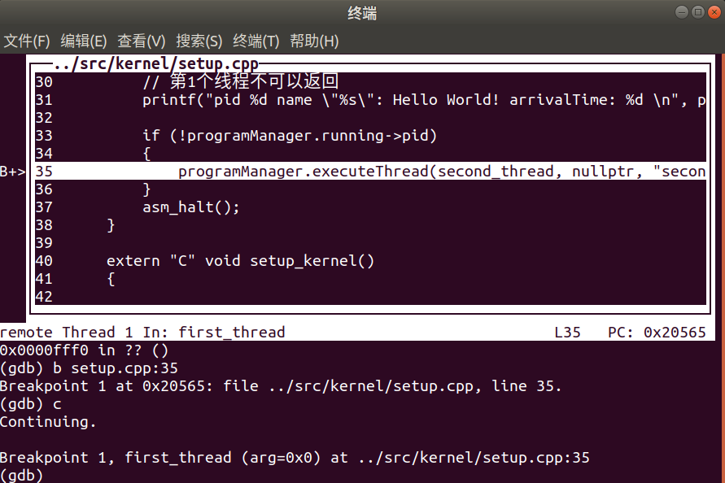
- 然后在中断函数处设置断点，输入 `c` 跳转到下一个时间中断：
  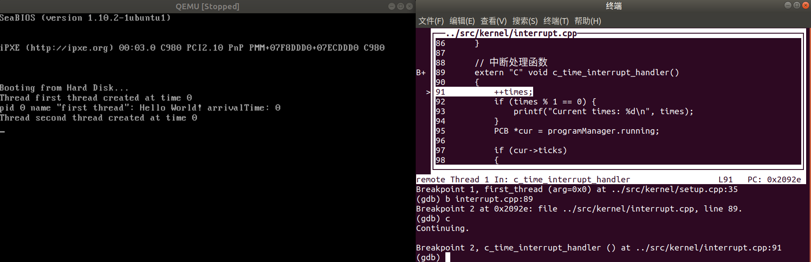
  - 观察输出可以得知线程二已经被创建
- 现在处于第一个时间中断，所以 `times` 变量的值为 1，
  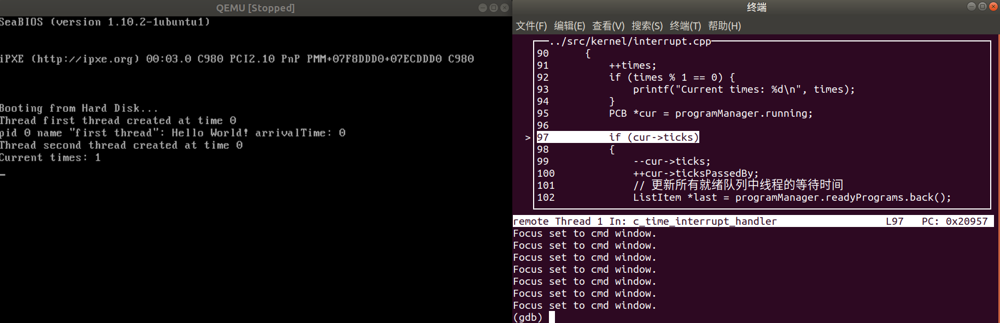
  由于已知设置的每个线程的优先级都是 1，也就是说每个线程的时间片都是十个中断，在这十个中断中，线程二一直处于就绪状态，线程一消耗时间片
  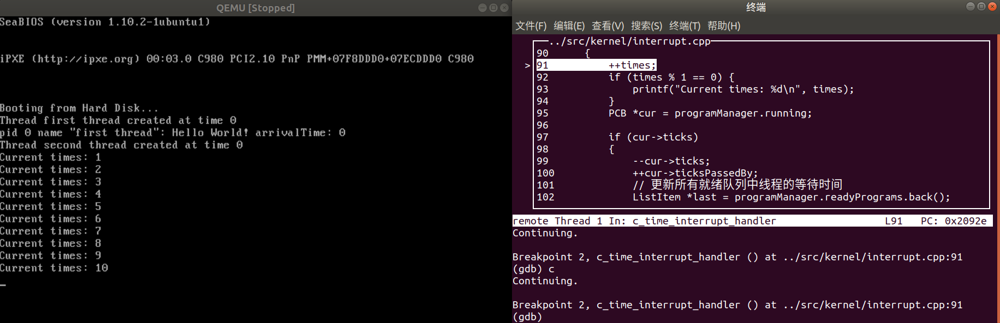
- 当线程一的时间片用完后，由中断函数中的条件判断跳转到 `programManager.schedule()` 函数中
  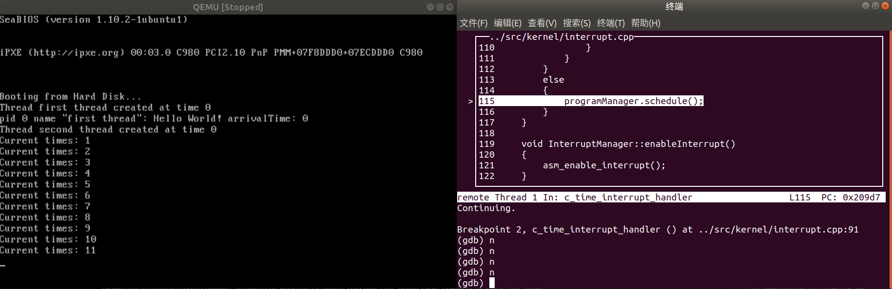
  - `programManager.schedule()` 函数将运行态的线程一转化为就绪态
    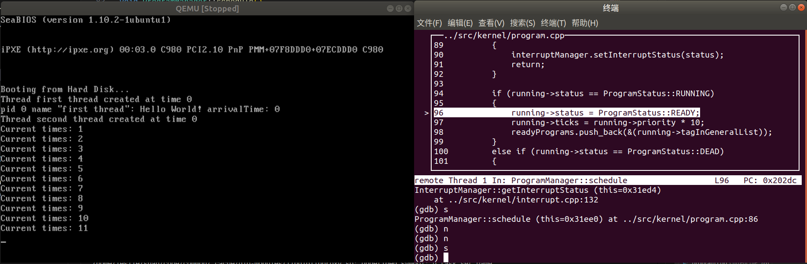
    并将 线程一 添加到就绪队列中 `readyPrograms.push_back(&(running->tagInGeneralList));`
  - 然后从就绪队列里面取出线程二，设置为运行态
    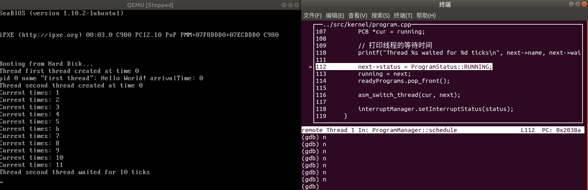
  - 最后调用 `asm_switch_thread` 函数切换线程
    - 首先保存寄存器 `ebp`，`ebx`，`edi`，`esi`
    - 然后将线程一的`esp` 指针保存到线程一的栈中，这里可以观察到 `esp` 指针的值是 `0x22e08`
        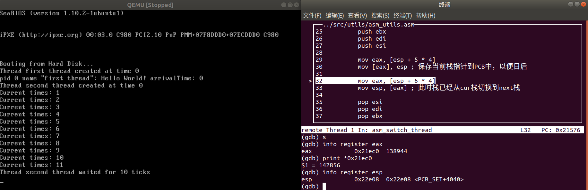
    - 最后将`next->stack`的值写入到`esp`中，完成线程切换（这里切换上来的是刚创建还未调度运行的的线程二）
    - 执行 `pop`，观察到将 4 个 0 值 放到 `esi`，`edi`，`ebx`，`ebp` 中
        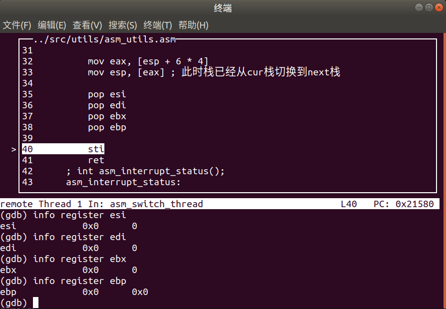
    - 执行`ret`，`function` 被加载进`eip`，使得 CPU 跳转到这个函数中执行
       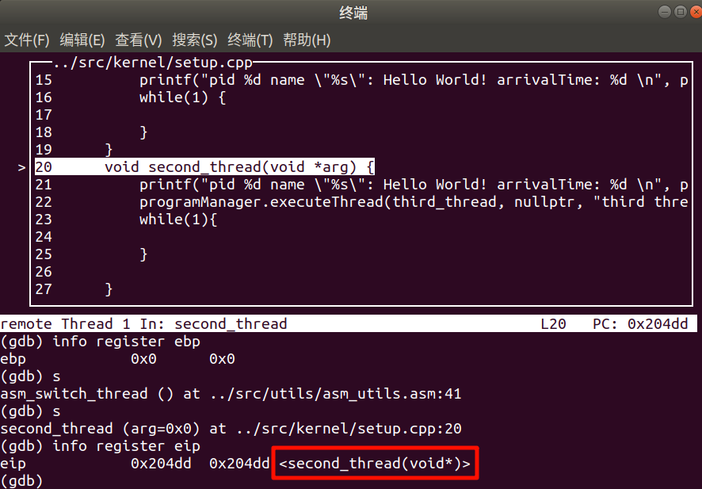
- 接着线程二开始执行，首先打印到达时间 `arrivalTime`，然后创建线程三，线程三进入就绪队列（注意就绪队列里面原来已经有线程一了，就绪队列：`→ 线程三 → 线程一 → `）
- 当线程二的时间片用完后，进行线程调度，线程二进入就绪队列（就绪队列：`→ 线程二 → 线程三 → 线程一 → `）这里展示线程一是如何从之前被换下处理器的地方继续执行的
  - 同样的，将`next->stack`（也就是线程一）的值写入到esp中，从而完成线程栈的切换
    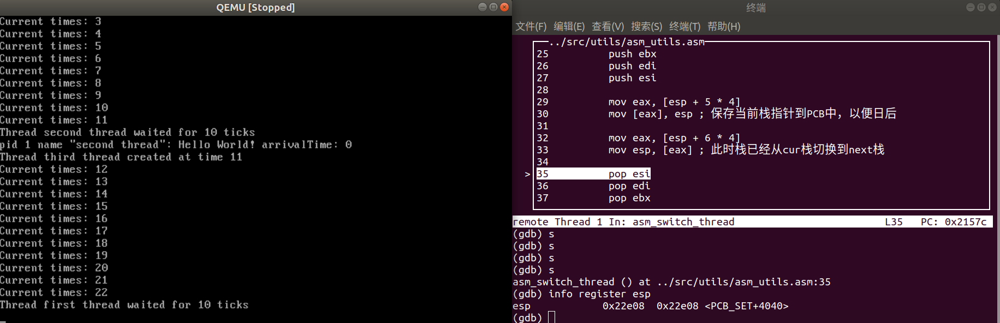
    - 可以看到`esp` 的值是 `0x22e08`，也就是之前线程一的栈指针
  - 然后执行`pop`，之前保存在线程栈中的内容会被恢复到`esi`，`edi`，`ebx`，`ebp`中
    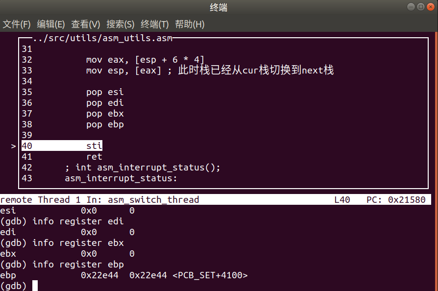
  - 最后执行`ret`，返回调用 `asm_switch_thread` 函数的地方（也就是`ProgramManager::schedule`函数），继续执行线程一的代码
    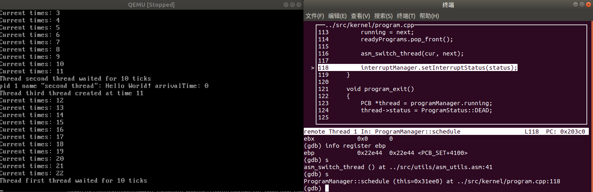
- 当线程一的时间片用完后，进行线程调度，线程一进入就绪队列（就绪队列：`→ 线程一 → 线程二 → 线程三 → `），线程三在等待线程二和线程一两个时间片用完后，现在开始执行
  - 观察到输出的线程三等待时间为 20，验证了线程三是等待线程二和线程一的时间片用完后才开始执行的
    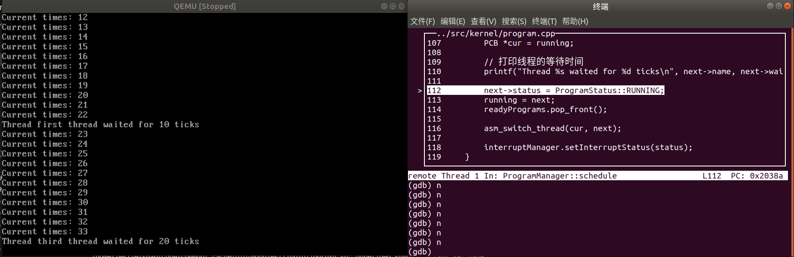
  - 然后跟上面一样切换到“创建而未调度运行”的线程三，执行`ret`跳转到线程三函数中执行并执行完 10 个时间片
   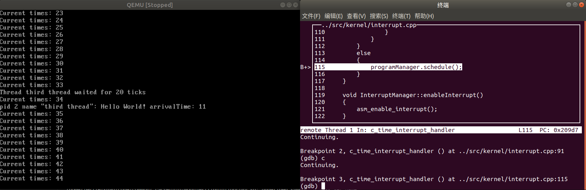
- 然后三个线程交替进行……
#### Assignment 4 调度算法的实现
##### 先来先服务（FCFS）
- 新写函数 `ProgramManager::scheduleFCFS()`，实现先来先服务调度算法：
    ```cpp
    // program.h
    // 其它代码...
    class ProgramManager
    {
        // 其它代码...
        public:
            // 其它代码...

            // 执行线程调度（先到先服务）
            void scheduleFCFS();

            // 其它代码...
    ```
    ```cpp
    // program.cpp
    void ProgramManager::scheduleFCFS()
    {
        bool status = interruptManager.getInterruptStatus();
        interruptManager.disableInterrupt();

        if (readyPrograms.size() == 0)
        {
            interruptManager.setInterruptStatus(status);
            return;
        }

        // 按到达时间排序就绪队列
        ListItem *earliest = readyPrograms.front();
        ListItem *item = readyPrograms.front();
        while (item)
        {
            PCB *pcb = ListItem2PCB(item, tagInGeneralList);
            PCB *earliestPCB = ListItem2PCB(earliest, tagInGeneralList);
            if (pcb->arrivalTime < earliestPCB->arrivalTime)
            {
                earliest = item;
            }
            item = item->next;
        }

        if (running->status == ProgramStatus::RUNNING)
        {
            running->status = ProgramStatus::READY;
            running->ticks = running->priority * 10;
            readyPrograms.push_back(&(running->tagInGeneralList));
        }
        else if (running->status == ProgramStatus::DEAD)
        {
            releasePCB(running);
        }


        PCB *next = ListItem2PCB(earliest, tagInGeneralList);
        PCB *cur = running;

        // 打印线程的等待时间
        printf("Thread %s waited for %d ticks\n", next->name, next->waitingTime);

        next->status = ProgramStatus::RUNNING;
        running = next;
        readyPrograms.erase(earliest);

        asm_switch_thread(cur, next);

        interruptManager.setInterruptStatus(status);
    }
    ```
- 去除中断函数 `c_time_interrupt_handler` 中的时间片相关的调度。为了实现非抢占式调度，只有线程结束时才调用下一个线程，所以调度只依赖于 `void program_exit()` 函数
    ```cpp
    // 中断处理函数
    extern "C" void c_time_interrupt_handler()
    {
        ++times;
        // 更新所有就绪队列中线程的等待时间
        ListItem *last = programManager.readyPrograms.back();
        if (last) {
            // 从head开始遍历到last
            ListItem *item = programManager.readyPrograms.head.next;
            while (item != nullptr && item != last->next) {
                PCB *pcb = ListItem2PCB(item, tagInGeneralList);
                pcb->waitingTime++;
                item = item->next;
            }
        }
    }
    ```
- 将线程结束时的 `void program_exit()` 函数调度算法改为 `scheduleFCFS()`：
    ```cpp
    void program_exit()
    {
        PCB *thread = programManager.running;
        thread->status = ProgramStatus::DEAD;

        if (thread->pid)
        {
            programManager.scheduleFCFS();
        }
        else
        {
            interruptManager.disableInterrupt();
            printf("halt\n");
            asm_halt();
        }
    }
    ```
- 将 `setup.cpp` 中创建线程二和线程三前加上延时，方便观察，并在创建完两个线程后，手动调用 `scheduleFCFS()` 函数，防止线程一一直执行
    ```cpp
    void third_thread(void *arg) {
        printf("pid %d name \"%s\": Hello World! arrivalTime: %d \n",
        programManager.running->pid,
        programManager.running->name,
        programManager.running->arrivalTime);
        while(1) {

        }
    }
    void second_thread(void *arg) {
        printf("pid %d name \"%s\": Hello World! arrivalTime: %d \n",
        programManager.running->pid,
        programManager.running->name,
        programManager.running->arrivalTime);
    }
    void first_thread(void *arg)
    {
        // 第1个线程不可以返回
        printf("pid %d name \"%s\": Hello World! arrivalTime: %d \n",
        programManager.running->pid,
        programManager.running->name,
        programManager.running->arrivalTime);

        if (!programManager.running->pid)
        {
            for(int i = 0; i < 100000000; i++);
            programManager.executeThread(second_thread, nullptr, "second thread", 1);
            for(int i = 0; i < 100000000; i++);
            programManager.executeThread(third_thread, nullptr, "third thread", 1);

            programManager.scheduleFCFS();
        }
        asm_halt();
    }
    ```
##### 优先级调度（Priority Scheduling）
- 增加 `ProgramManager::schedulePriority()` 函数
    ```cpp
    // program.h
    // 其它代码...
        class ProgramManager
        {
            // 其它代码...
            public:
                // 其它代码...

                // 执行线程调度（优先级调度）
                void schedulePriority();

                // 其它代码...
    ```
    ```cpp
    // program.cpp
    void ProgramManager::schedulePriority()
    {
        bool status = interruptManager.getInterruptStatus();
        interruptManager.disableInterrupt();

        if (readyPrograms.size() == 0)
        {
            interruptManager.setInterruptStatus(status);
            return;
        }

        // 找到优先级最高的线程
        ListItem *highestPriorityItem = readyPrograms.front();
        ListItem *item = readyPrograms.front();
        while (item)
        {
            PCB *pcb = ListItem2PCB(item, tagInGeneralList);
            PCB *highestPriorityPCB = ListItem2PCB(highestPriorityItem, tagInGeneralList);
            if (pcb->priority > highestPriorityPCB->priority)
            {
                highestPriorityItem = item;
            }
            item = item->next;
        }

        if (running->status == ProgramStatus::RUNNING)
        {
            running->status = ProgramStatus::READY;
            running->ticks = running->priority * 10;
            readyPrograms.push_back(&(running->tagInGeneralList));
        }
        else if (running->status == ProgramStatus::DEAD)
        {
            releasePCB(running);
        }

        PCB *next = ListItem2PCB(highestPriorityItem, tagInGeneralList);
        PCB *cur = running;

        // 打印线程的等待时间
        printf("Thread %s waited for %d ticks\n", next->name, next->waitingTime);

        next->status = ProgramStatus::RUNNING;
        running = next;
        readyPrograms.erase(highestPriorityItem);

        asm_switch_thread(cur, next);

        interruptManager.setInterruptStatus(status);
    }
    ```
- 修改 `void program_exit()` 函数调度算法为 `schedulePriority()`
- 修改 `setup.cpp` 中创建线程一、二、三的优先级为 1、2、3，并将线程三的`while(1)` 循环去掉
    ```cpp
    void third_thread(void *arg) {
        printf("pid %d name \"%s\": Hello World! arrivalTime: %d \n", 
        programManager.running->pid,
        programManager.running->name,
        programManager.running->arrivalTime);
    }
    void second_thread(void *arg) {
        printf("pid %d name \"%s\": Hello World! arrivalTime: %d \n", 
        programManager.running->pid,
        programManager.running->name,
        programManager.running->arrivalTime);
    }
    void first_thread(void *arg)
    {
        // 第1个线程不可以返回
        printf("pid %d name \"%s\": Hello World! arrivalTime: %d \n", 
        programManager.running->pid,
        programManager.running->name,
        programManager.running->arrivalTime);

        if (!programManager.running->pid)
        {
            for(int i = 0; i < 100000000; i++);
            programManager.executeThread(second_thread, nullptr, "second thread", 2);
            for(int i = 0; i < 100000000; i++);
            programManager.executeThread(third_thread, nullptr, "third thread", 3);

            programManager.schedulePriority();
        }
        asm_halt();
    }
    ```
### 三、实验结果
#### Assignment 1 printf 的实现
- 修改 `setup.cpp` 中的 `setup_kernel` 函数，增加对 `printf` 函数的测试：
    ```cpp
    extern "C" void setup_kernel()
    {
        // 中断处理部件
        interruptManager.initialize();
        // 屏幕IO处理部件
        stdio.initialize();
        interruptManager.enableTimeInterrupt();
        interruptManager.setTimeInterrupt((void *)asm_time_interrupt_handler);
        //asm_enable_interrupt();
        printf("print percentage: %%\n"
            "print char \"N\": %c\n"
            "print string \"Hello World!\": %s\n"
            "print decimal: \"-1234\": %7d\n"
            "print hexadecimal \"0x7abcdef0\": %x\n"
            "print float \"2.3336050000\": %9.3f\n"
            "print octal \"23336050\": %o\n"
            "print scientific \"2.3336050000\": %.2e\n",
            'N', "Hello World!", -1234, 0x7abcdef0, 2.3336050000, 23336050 ,2.3336050000);
        //uint a = 1 / 0;
        asm_halt();
    }
    ```
- 实验结果
  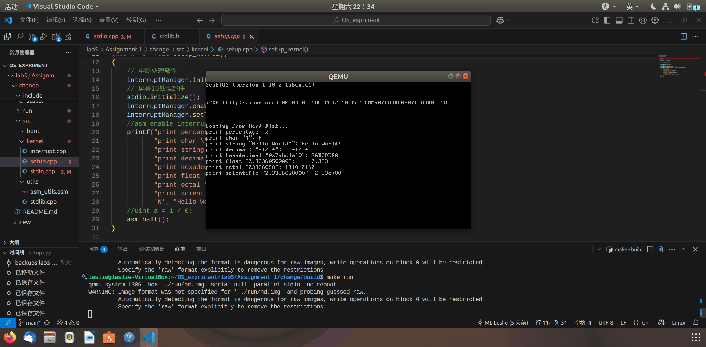
#### Assignment 2 线程的实现
- 为了更好看到修改后 `arrivalTime` 的效果，分别增加了 `setup.cpp` 中的三个线程打印的信息：（这里只举第一个线程为例）：
    ```cpp
    void first_thread(void *arg)
    {
        // 第1个线程不可以返回
        printf("pid %d name \"%s\": Hello World! arrivalTime: %d \n", 
        programManager.running->pid,
        programManager.running->name,
        programManager.running->arrivalTime);

        if (!programManager.running->pid)
        {
            programManager.executeThread(second_thread, nullptr, "second thread", 1);
            programManager.executeThread(third_thread, nullptr, "third thread", 1);
        }
        asm_halt();
    }
    ```
- 并且在 `interrupt.cpp` 中的 `extern "C" void c_time_interrupt_handler()` 中增加对当前时间的输出：
    ```cpp
    extern "C" void c_time_interrupt_handler()
    {
        ++times;
        if (times % 1 == 0) {
            printf("Current times: %d\n", times);
        }
        // 其他代码...
    ```
- 运行结果：
    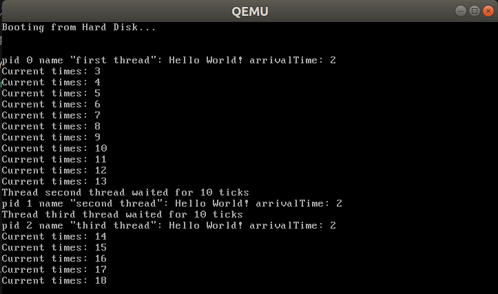
    - 通过上面的结果可以看到：
      - 三个线程由于创建速度很快，是同个时间中断创建的（arrivalTime 相同）
      - 线程二和三等待线程一的十个时间片（`priority *10`）用完后才开始执行（`waitingTime = 10`）
- 为了更好看到线程是同个时间中断创建的：
  - 在 `program.cpp` 中增加线程创建时候的信息打印：
    ```cpp
    int ProgramManager::executeThread(ThreadFunction function, void *parameter, const char *name, int priority)
    {
        // 其他代码...

        // 打印线程创建信息
        printf("Creating thread %s with pid %d\n", name, thread->pid);

        // 其他代码...
    }
    ```
  - 运行结果：
    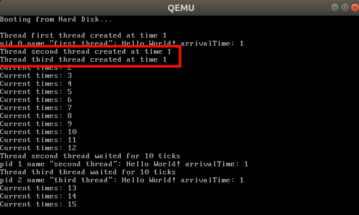
    - 红色框选部分即可表明三个线程是同个时间中断创建的
#### Assignment 3 线程调度切换的秘密
- 见 ↑ [Assignment 3 线程调度切换的秘密](#assignment-3-线程调度切换的秘密)
#### Assignment 4 调度算法的实现
##### 先到先服务（FCFS）
- 运行结果：
    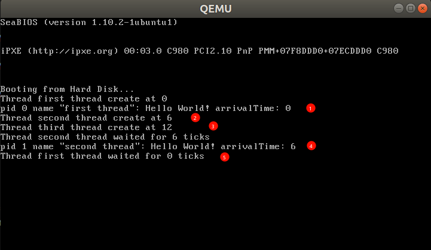
- 观察运行结果
  - 线程一首先执行（图中标号①）
  - 然后线程二和三分别创建，分别在 6 和 12 时刻创建（图中标号②和③）
  - 到了手动执行 `scheduleFCFS()` 函数时，就绪队列里有两个线程：线程二和线程三，相比之下线程二先创建，所以线程二先执行，同时线程一 `push` 进入就绪队列（图中标号④）
  - 线程二执行完之后，`void program_exit()` 函数会被调用，线程二的状态变为 `DEAD`，然后调用 `scheduleFCFS()` 函数，此时就绪队列里只有线程一和线程三，线程一先创建，所以线程一执行（图中标号⑤）
  - 线程一由于不能返回，所以会一直执行，线程三不会被调度到
##### 优先级调度（Priority Scheduling）
- 运行结果：
    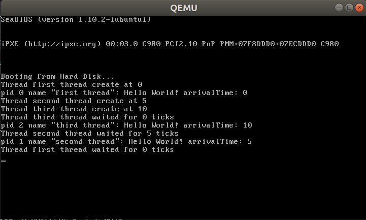
- 由于设置了线程一、二、三的优先级分别为 1、2、3，所以手动调用`schedulePriority()` 函数后，就绪队列中的两个线程是线程二和线程三，线程三优先级高，所以线程三先执行
- 线程三执行完后，`void program_exit()` 函数会被调用，线程三的状态变为 `DEAD`，然后调用 `schedulePriority()` 函数，此时就绪队列里只有线程一和线程二，线程二优先级高，所以线程二执行
- 线程二执行完后，线程二的状态变为 `DEAD`，然后调用 `schedulePriority()` 函数，此时就绪队列里只有线程一，线程一执行
### 四、总结
- 通过本次实验，了解了操作系统中线程的基本实现原理，线程调度的基本原理，以及如何实现简单的调度算法
- 通过对 `printf` 函数的实现，了解了格式化输出的基本原理，并且增加对小数点、8 进制、科学计数法以及宽度精度的支持
- 通过调试查看函数跳转与寄存器的值，了解了线程调度的切换中保存和恢复上下文的原理
- 实现两个调度算法，成功实现调度，并且观察到调度算法的不同对线程执行顺序的影响
