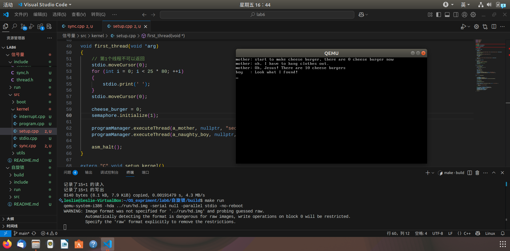
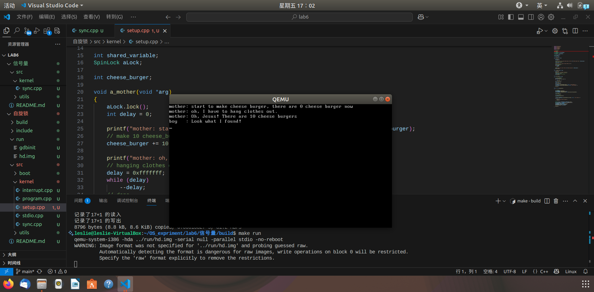
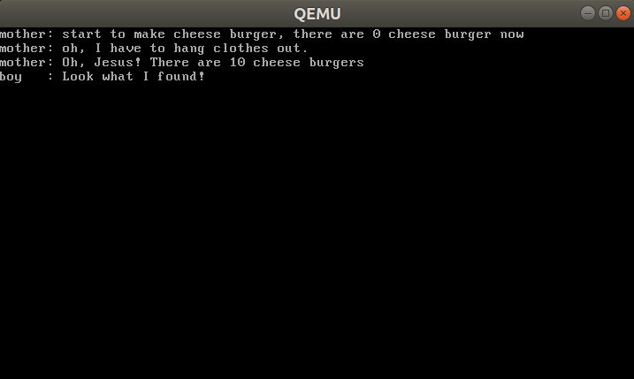
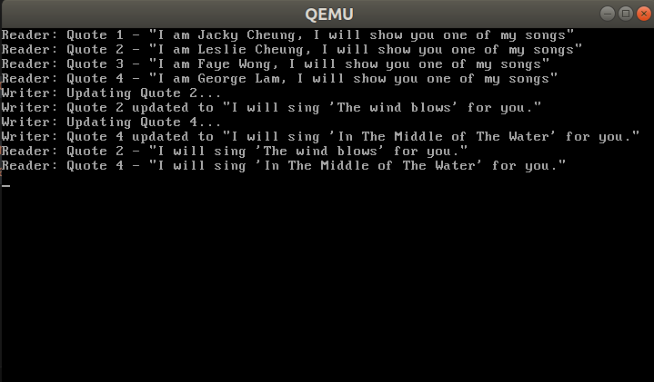
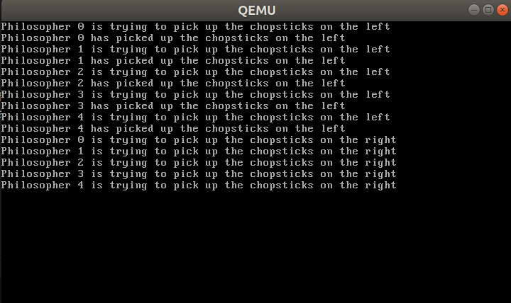
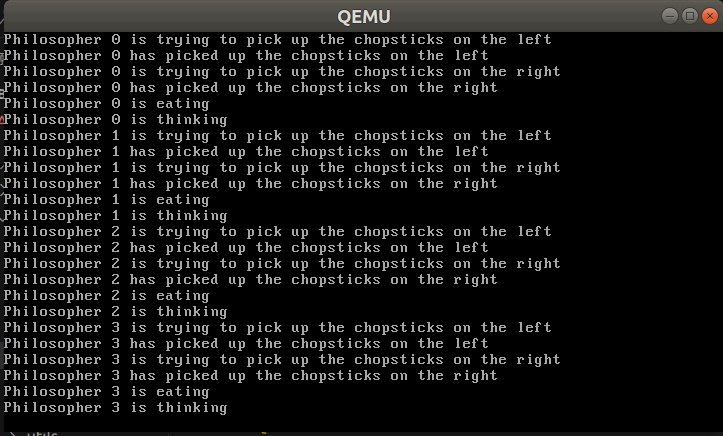

## 📌 目录
- [📌 目录](#-目录)
  - [一、实验要求](#一实验要求)
  - [二、实验过程\&关键代码](#二实验过程关键代码)
    - [Assignment 1 代码复现题](#assignment-1-代码复现题)
      - [1.1 代码复现](#11-代码复现)
        - [自旋锁](#自旋锁)
        - [信号量](#信号量)
      - [1.2 锁机制的实现](#12-锁机制的实现)
    - [Assignment 2 生产者-消费者问题](#assignment-2-生产者-消费者问题)
      - [2.1 Race Condition](#21-race-condition)
      - [2.2 信号量解决方法](#22-信号量解决方法)
    - [Assignment 3 哲学家就餐问题](#assignment-3-哲学家就餐问题)
      - [3.1 初步解决方案（可能导致死锁）](#31-初步解决方案可能导致死锁)
      - [3.2 解决死锁](#32-解决死锁)
  - [三、实验结果](#三实验结果)
    - [1 代码复现题](#1-代码复现题)
    - [2 生产者-消费者问题](#2-生产者-消费者问题)
      - [2.1 Race Condition](#21-race-condition-1)
      - [2.2 信号量解决方法](#22-信号量解决方法-1)
    - [3 哲学家就餐问题](#3-哲学家就餐问题)
      - [3.1 可能会导致死锁的解决方案](#31-可能会导致死锁的解决方案)
      - [3.2 解决死锁](#32-解决死锁-1)
  - [四、总结](#四总结)

### 一、实验要求
- 本次实验中，首先使用硬件支持的原子指令来实现自旋锁 SpinLock
- 接着，使用 SpinLock 来实现信号量，最后使用 SpinLock 和信号量来给出两个实现线程互斥的解决方案。
- 在实例代码基础上，探索其他原子指令实现锁机制
- 尝试解决生产者-消费者问题和哲学家问题
### 二、实验过程&关键代码
#### Assignment 1 代码复现题
##### 1.1 代码复现
###### 自旋锁
- 自旋锁通过共享变量 `bolt` 实现互斥访问，在访问临界区之前，线程会不断地检查 `bolt` 的值，如果 `bolt` 为 0，则表示锁可用，线程可以进入临界区；如果 `bolt` 为 1，则表示锁被占用，线程会自旋等待。
- 在实现 `lock` 函数时要注意
    ```cpp
    void SpinLock::lock()
    {
        uint32 key = 1;

        do
        {
            asm_atomic_exchange(&key, &bolt);
        } while (key);
    }
    ```

    ```nasm
    ; void asm_atomic_exchange(uint32 *register, uint32 *memeory);
    asm_atomic_exchange:
        push ebp
        mov ebp, esp
        pushad

        mov ebx, [ebp + 4 * 2] ; register
        mov eax, [ebx]      ; 取出register指向的变量的值
        mov ebx, [ebp + 4 * 3] ; memory
        xchg [ebx], eax      ; 原子交换指令
        mov ebx, [ebp + 4 * 2] ; memory
        mov [ebx], eax      ; 将memory指向的值赋值给register指向的变量

        popad
        pop ebp
        ret
    ```
    - 为了保证原子性，`void asm_atomic_exchange(uint32 *register, uint32 *memeory)` 函数传入的 `register` 不能指向一个共享变量，否则会发生两个线程同时访问与修改共享变量的情况，使得互斥失效
- 复现结果：
  
###### 信号量
- 在实现了自旋锁的基础上，拥有了对某个变量互斥访问的能力，但只使用自旋锁会导致
  - 忙等待
  - 可能饥饿
  - 可能死锁
- 信号量的实现需要在自旋锁的基础上，增加一个计数器 `count`，表示当前可用资源的数量，并在访问临界区资源的前后采用 P 和 V 操作来控制资源的使用。
- 复现结果：
  
##### 1.2 锁机制的实现
- 采用 `lock bts` 指令实现自旋锁
> - `bts` 指令是 x86 架构中的一个原子操作指令，执行以下操作：
>   - 测试指定位是否为 1
>   - 将被测试位的原始值存储到进位标志(CF，Carry Flag) 中
>   - 将该位设置为1
> - 配合上 `lock` 前缀，可以确保这条指令在多线程环境下的原子性
- 当临界资源被占用时，设置后 `bolt` 的值保持为 1，并返回 1，表示锁被占用；当临界资源可用时，`lock bts` 指令会将 `bolt` 的值从 0 设置为 1，并返回 1，表示锁可用
- 在 `asm_utils.asm` 中实现 `asm_atomic_bts` 函数
    ```nasm
    ; uint32 asm_atomic_bts(uint32 *lock);
    ; 返回值: 0表示获取锁成功，非0表示锁已被占用
    asm_atomic_bts:
        push ebp
        mov ebp, esp
        
        mov ebx, [ebp + 8]     ; 获取lock的地址
        mov eax, 0             ; 清零eax
        lock bts dword [ebx], 0 ; 原子地测试并设置第0位
        jnc .acquired          ; 如果进位标志位为0，说明原来的位是0，获取锁成功
        mov eax, 1             ; 锁已被占用，返回1
        
    .acquired:
        pop ebp
        ret
    ```
- 在 `SpinLock::lock` 函数中调用 `asm_atomic_bts` 函数来获取锁
    ```cpp
    void SpinLock::lock()
    {
        
        while (asm_atomic_bts(&bolt))
        {
            // 自旋等待锁释放
        }
    }
    ```
- 运行结果：
    
    - 可以看到正确实现了自旋锁的功能
#### Assignment 2 生产者-消费者问题
- 这里选择 **读者-写者** 问题来展示
- 根据提示中的线程创建代码，可以创建这样的情境：
  - 定义一个大小为 4 的 `char *` 数组
  - 先创建 4 个读者线程（消费者）
  - 然后创建 2 个运行时间都超过时间片长度的写者线程（生产者），分别重写数组第二个元素和第四个元素
  - 最后再创建 2 个读线程（消费者），分别读取数组第二个元素和第四个元素
  ```cpp
  //模拟读错误
  //创建线程读第1-4条记录
  programManager.executeThread(readFirstQuote, nullptr, "second thread", 1);
  programManager.executeThread(readSecondQuote, nullptr, "third thread", 1);
  programManager.executeThread(readThirdQuote, nullptr, "fourth thread", 1);
  programManager.executeThread(readFourthQuote, nullptr, "fifth thread", 1);
  //创建线程，修改第2条和第4条记录为较长内容
  //由于写时间较长，写线程运行时间大于RRschedule的time quantum
  programManager.executeThread(writeSecondQuote, nullptr, "sixth thread", 1);
  programManager.executeThread(writeFourthQuote, nullptr, "seventh thread", 1);
  //创建线程读第2条和第4条记录
  //发现没有读到修改后的项，而是输出了初始项
  programManager.executeThread(readSecondQuote, nullptr, "eighth thread", 1);
  programManager.executeThread(readFourthQuote, nullptr, "ninth thread", 1);
  ```
  - 如果没有加互斥锁和使用信号量，第二次读取的结果会是初始值
  - 如果加上互斥锁，第二次读取的结果会是修改后的值
##### 2.1 Race Condition
- 首先设置要显示的变量 `quotes`：
    ```cpp
    #define QUOTES_COUNT 4
    char* quotes[QUOTES_COUNT] = {
        "I am Jacky Cheung, I will show you one of my songs",
        "I am Leslie Cheung, I will show you one of my songs",
        "I am Faye Wong, I will show you one of my songs",
        "I am George Lam, I will show you one of my songs"
    };
    ```
- 然后定义读者和写者线程函数：
  - 读者线程函数：
    ```cpp
    // 读取第1条记录
    void readFirstQuote(void *arg) {
        int delay = 0x1ffffff;
        while (delay) --delay;
        
        // 读取操作
        printf("Reader: Quote 1 - \"%s\"\n", quotes[0]);
        
    }

    // 读取第2条记录
    void readSecondQuote(void *arg) {
        int delay = 0x1ffffff;
        while (delay) --delay;
        
        // 读取操作
        printf("Reader: Quote 2 - \"%s\"\n", quotes[1]);
        
    }

    // 读取第3条记录
    void readThirdQuote(void *arg) {
        int delay = 0x1ffffff;
        while (delay) --delay;
        
        // 读取操作
        printf("Reader: Quote 3 - \"%s\"\n", quotes[2]);
        
    }

    // 读取第4条记录
    void readFourthQuote(void *arg) {
        int delay = 0x1ffffff;
        while (delay) --delay;
        
        // 读取操作
        printf("Reader: Quote 4 - \"%s\"\n", quotes[3]);
        
    }
    ```
    - 简单实现读取操作，没有加锁
  - 写者线程函数：
    ```cpp
    // 修改第2条记录
    void writeSecondQuote(void *arg) {
        int delay = 0xfffffff;
        
        // 写入操作（耗时较长）
        printf("Writer: Updating Quote 2...\n");
        while (delay) --delay;
        
        quotes[1] = "I will sing 'The wind blows' for you.";
        printf("Writer: Quote 2 updated to \"%s\"\n", quotes[1]);

    }

    // 修改第4条记录
    void writeFourthQuote(void *arg) {
        int delay = 0xfffffff;
        
        // 写入操作（耗时较长）
        printf("Writer: Updating Quote 4...\n");
        while (delay) --delay;
        
        quotes[3] = "I will sing 'In The Middle of The Water' for you.";
        printf("Writer: Quote 4 updated to \"%s\"\n", quotes[3]);
    }
    ```
    - 简单实现写入操作，也没有加锁
- 载入第一个线程启动
    ```cpp
    // 错误版本演示
    void reader_writer_error(void *arg) {
        // 创建线程读第1-4条记录
        programManager.executeThread(readFirstQuote, nullptr, "second thread", 1);
        programManager.executeThread(readSecondQuote, nullptr, "third thread", 1);
        programManager.executeThread(readThirdQuote, nullptr, "fourth thread", 1);
        programManager.executeThread(readFourthQuote, nullptr, "fifth thread", 1);
        
        // 创建线程，修改第2条和第4条记录为较长内容
        programManager.executeThread(writeSecondQuote, nullptr, "sixth thread", 1);
        programManager.executeThread(writeFourthQuote, nullptr, "seventh thread", 1);
        
        // 创建线程读第2条和第4条记录
        programManager.executeThread(readSecondQuote, nullptr, "eighth thread", 1);
        programManager.executeThread(readFourthQuote, nullptr, "ninth thread", 1); 
    }

    void first_thread(void *arg)
    {
        // 清屏
        stdio.moveCursor(0);
        for (int i = 0; i < 25 * 80; ++i)
        {
            stdio.print(' ');
        }
        stdio.moveCursor(0);
        
        programManager.executeThread(reader_writer_error, nullptr, "demo_error", 1);
        
        asm_halt();
    }
    ```
##### 2.2 信号量解决方法
- 为了解决读者-写者问题，设置以下信号量和互斥锁
    ```cpp
    // 互斥锁和计数器
    Semaphore rwMutex;       // 控制读写互斥
    Semaphore readCountMutex; // 保护readCount
    int readCount = 0;       // 当前读者数量
    ```
  - **明确**：1. 读者和写者互斥，2. 多个读者可以同时访问
  - 所以只需要设置信号量 `rwMutex` 来控制读写互斥
  - 对于多个读者问题，使用 `readCount` 计数器来记录当前读者数量，并使用 信号量 `readCountMutex` 来保护对 `readCount` 的访问
- 读者线程函数：
    ```cpp
    // 读取第1条记录
    void readFirstQuote(void *arg) {
        int delay = 0x1ffffff;
        while (delay) --delay;
        
        // 等待readCountMutex
        readCountMutex.P();
        readCount++;
        if (readCount == 1) {
            // 第一个读者需要获取rwMutex
            rwMutex.P();
        }
        readCountMutex.V();
        
        // 读取操作
        printf("Reader: Quote 1 - \"%s\"\n", quotes[0]);
        
        // 等待readCountMutex
        readCountMutex.P();
        readCount--;
        if (readCount == 0) {
            // 最后一个读者释放rwMutex
            rwMutex.V();
        }
        readCountMutex.V();
    }

    // 读取第2条记录
    void readSecondQuote(void *arg) {
        int delay = 0x1ffffff;
        while (delay) --delay;
        
        // 等待readCountMutex
        readCountMutex.P();
        readCount++;
        if (readCount == 1) {
            // 第一个读者需要获取rwMutex
            rwMutex.P();
        }
        readCountMutex.V();
        
        // 读取操作
        printf("Reader: Quote 2 - \"%s\"\n", quotes[1]);
        
        // 等待readCountMutex
        readCountMutex.P();
        readCount--;
        if (readCount == 0) {
            // 最后一个读者释放rwMutex
            rwMutex.V();
        }
        readCountMutex.V();
    }

    // 读者函数 - 读取第3条记录
    void readThirdQuote(void *arg) {
        int delay = 0x1ffffff;
        while (delay) --delay;
        
        // 等待readCountMutex
        readCountMutex.P();
        readCount++;
        if (readCount == 1) {
            // 第一个读者需要获取rwMutex
            rwMutex.P();
        }
        readCountMutex.V();
        
        // 读取操作
        printf("Reader: Quote 3 - \"%s\"\n", quotes[2]);
        
        // 等待readCountMutex
        readCountMutex.P();
        readCount--;
        if (readCount == 0) {
            // 最后一个读者释放rwMutex
            rwMutex.V();
        }
        readCountMutex.V();
    }

    // 读者函数 - 读取第4条记录
    void readFourthQuote(void *arg) {
        int delay = 0x1ffffff;
        while (delay) --delay;
        

        // 等待readCountMutex
        readCountMutex.P();
        readCount++;
        if (readCount == 1) {
            // 第一个读者需要获取rwMutex
            rwMutex.P();
        }
        readCountMutex.V();
        
        // 读取操作
        printf("Reader: Quote 4 - \"%s\"\n", quotes[3]);
        
        // 等待readCountMutex
        readCountMutex.P();
        readCount--;
        if (readCount == 0) {
            // 最后一个读者释放rwMutex
            rwMutex.V();
        }
        readCountMutex.V();
        
    }
    ```
    - **可以注意到**：读者线程在访问临界区之前，先递增 `readCount`，然后判断是否是第一个读者，如果是，则获取 `rwMutex` 锁；在访问完临界区后，递减 `readCount`，如果是最后一个读者，则释放 `rwMutex` 锁
- 写者线程函数：
    ```cpp
    // 写者函数 - 修改第2条记录
    void writeSecondQuote(void *arg) {
        int delay = 0xfffffff;

        rwMutex.P();
        
        // 写入操作（耗时较长）
        printf("Writer: Updating Quote 2...\n");
        while (delay) --delay;
        
        quotes[1] = "I will sing 'The wind blows' for you.";
        printf("Writer: Quote 2 updated to \"%s\"\n", quotes[1]);
        
        rwMutex.V();
        
    }

    // 写者函数 - 修改第4条记录
    void writeFourthQuote(void *arg) {
        int delay = 0xfffffff;
        
        rwMutex.P();
        
        // 写入操作（耗时较长）
        printf("Writer: Updating Quote 4...\n");
        while (delay) --delay;
        
        quotes[3] = "I will sing 'In The Middle of The Water' for you.";
        printf("Writer: Quote 4 updated to \"%s\"\n", quotes[3]);
        
        rwMutex.V();
        
    }
    ```
    - 在访问临界区之前，写者线程会获取 `rwMutex` 锁，在访问完临界区后，释放 `rwMutex` 锁
#### Assignment 3 哲学家就餐问题

##### 3.1 初步解决方案（可能导致死锁）
- 首先分析关系：每个哲学家与左右两边的哲学家对他们中间的筷子有互斥访问的需求
- 所以对这五根筷子使用互斥锁来实现互斥访问
- 定义互斥信号量 `chopsticks[PHILOSOPHER_COUNT] = {1, 1, 1, 1, 1}`。哲学家编号为 0-4，对于 `i` 号哲学家：左边的筷子编号为 `i`，右边的筷子编号为 `(i + 1) % PHILOSOPHER_COUNT`
    ```cpp
    #define PHILOSOPHER_COUNT 5  // 哲学家数量
    Semaphore chopsticks[PHILOSOPHER_COUNT];  // 每根筷子一个信号量
    ```
- 哲学家线程函数：
    ```cpp
    void Philosopher(void *arg)
    {
        int id = *(int *)arg;  // 哲学家的编号
        // 哲学家就餐
        do
        {
            // 取左边的筷子
            printf("Philosopher %d is trying to pick up the chopsticks on the left\n", id);
            chopsticks[id].P();
            printf("Philosopher %d has picked up the chopsticks on the left\n", id);
            // 取右边的筷子
            printf("Philosopher %d is trying to pick up the chopsticks on the right\n", id);
            chopsticks[(id + 1) % PHILOSOPHER_COUNT].P();
            printf("Philosopher %d has picked up the chopsticks on the right\n", id);
            // 吃饭
            printf("Philosopher %d is eating\n", id);
            // 放下左边的筷子
            chopsticks[id].V();
            // 放下右边的筷子
            chopsticks[(id + 1) % PHILOSOPHER_COUNT].V();
            // 思考
            printf("Philosopher %d is thinking\n", id);
        }
        while(1);
    }
    ```
- 载入第一个线程启动
    ```cpp
    // 运行哲学家就餐问题
    void first_thread(void *arg)
    {
        stdio.moveCursor(0);
        for (int i = 0; i < 25 * 80; ++i)
        {
            stdio.print(' ');
        }
        stdio.moveCursor(0);

        // 初始化信号量
        for (int i = 0; i < PHILOSOPHER_COUNT; ++i)
        {
            chopsticks[i].initialize(1);  // 每根筷子初始状态为可用
        }
    
        int philosopher_ids[PHILOSOPHER_COUNT] = {0, 1, 2, 3, 4};
        programManager.executeThread(Philosopher, &philosopher_ids[0], "Philosopher 0", 1);
        programManager.executeThread(Philosopher, &philosopher_ids[1], "Philosopher 1", 1);
        programManager.executeThread(Philosopher, &philosopher_ids[2], "Philosopher 2", 1);
        programManager.executeThread(Philosopher, &philosopher_ids[3], "Philosopher 3", 1);
        programManager.executeThread(Philosopher, &philosopher_ids[4], "Philosopher 4", 1);

        asm_halt();
    }
    ```
    - 首先清屏
    - 然后初始化信号量
    - 创建五个哲学家线程
- ps：为了展示死锁，可以在拿起左边的筷子后添加等待时间，使哲学家们的操作更接近于同时进行，这样可以模拟所有哲学家都手拿着左边的筷子，等待右边的筷子被释放的死锁情况【具体见 ↓ [3 哲学家就餐问题](#3-哲学家就餐问题)】
##### 3.2 解决死锁
> - 解决死锁的方法有很多种：
>   - 至多允许 4 个哲学家同时就餐
>   - 对哲学家进行编号，编号为奇数的哲学家先拿起左边的筷子，再拿起右边的筷子；编号为偶数的哲学家则相反
>   - 只有一个哲学家可以同时拿起两根筷子时才允许拿起两根筷子吃饭
>   - ……
- 这里采用最简单粗暴的方法：只有一个哲学家可以同时拿起两根筷子时才允许拿起两根筷子吃饭
- 只需要多设置一个信号量 `mutex`，在拿起左边的筷子之前先获取 `mutex` 锁，在放下右边的筷子之后释放 `mutex` 锁，这样就能保证一定有一个哲学家可以同时拿起两根筷子进行吃饭，吃完就能释放资源给其他哲学家
- 更改后的代码：
    ```cpp
    #define PHILOSOPHER_COUNT 5  // 哲学家数量
    Semaphore chopsticks[PHILOSOPHER_COUNT];  // 每根筷子一个信号量
    Semaphore mutex;  // 互斥信号量

    void Philosopher(void *arg)
    {
        do{
            int id = *(int *)arg;  // 哲学家的编号
            // 哲学家就餐
            mutex.P();  // 进入临界区
            // 取左边的筷子
            printf("Philosopher %d is trying to pick up the chopsticks on the left\n", id);
            chopsticks[id].P();
            printf("Philosopher %d has picked up the chopsticks on the left\n", id);
            // 取右边的筷子
            printf("Philosopher %d is trying to pick up the chopsticks on the right\n", id);
            chopsticks[(id + 1) % PHILOSOPHER_COUNT].P();
            printf("Philosopher %d has picked up the chopsticks on the right\n", id);
            mutex.V();  // 离开临界区
            // 吃饭
            printf("Philosopher %d is eating\n", id);
            // 放下左边的筷子
            chopsticks[id].V();
            // 放下右边的筷子
            chopsticks[(id + 1) % PHILOSOPHER_COUNT].V();
            // 思考
            printf("Philosopher %d is thinking\n", id);
            // 等待一段时间
            int delay = 0xfffffff;
            while (delay) --delay;
        }
        while(1);
    }
    ```
    - 在拿起两边筷子前后夹逼着 `mutex` 锁
    - 最后 `thinking` 后添加了一个等待时间，模拟哲学家思考的过程（同时也配合着时间片长度使得展示结果更加美观：不会有哲学家一直重复多次吃饭的情况）
### 三、实验结果
#### 1 代码复现题
- 见 ↑ [Assignment 1 代码复现题](#assignment-1-代码复现题)
#### 2 生产者-消费者问题
##### 2.1 Race Condition
- 实验结果
  
- 从结果可以看到：没有信号量与互斥锁，写者线程还未完成写的操作，读者线程就已经开始读取了，读取到的值是初始值
##### 2.2 信号量解决方法
- 实验结果
    
- 可以看到，第二次读取的结果是修改后的值，读者线程是等到写者线程释放锁后才开始读取的
#### 3 哲学家就餐问题
##### 3.1 可能会导致死锁的解决方案
- 在拿起左边筷子后添加等待时间，模拟死锁情况
    ```cpp
    void Philosopher(void *arg)
    {
        // 其它代码...
        
        int id = *(int *)arg;  // 哲学家的编号
        // 哲学家就餐
        do
        {
            // 取左边的筷子
            printf("Philosopher %d is trying to pick up the chopsticks on the left\n", id);
            chopsticks[id].P();
            printf("Philosopher %d has picked up the chopsticks on the left\n", id);
            int delay = 0xfffffff;
            while (delay) --delay;

        // 其它代码...
    }
    ```
- 实验结果：
  
- 可以看到，所有哲学家成功拿到了左边的筷子，但都在等待右边的筷子，导致死锁，程序无法继续执行
##### 3.2 解决死锁
- 实验结果
  
- 观察到每位哲学家都能拿起左右两根筷子，成功就餐，程序能一直进行不会出现死锁
### 四、总结
- 本次实验主要是对自旋锁、信号量、互斥锁的实现与使用进行了复现和探索
- 通过对生产者-消费者问题和哲学家就餐问题的实现，深入理解了多线程编程中的同步与互斥问题
- 在实现生产者-消费者问题中构思了“读者-写者”问题的情境，并根据提示代码构思线程函数的编写，并设置适当的互斥锁和信号量来解决读写不同步的问题，顺便也完善了多读者问题
- 在实现哲学家就餐问题中，构思如何展示错误与如何解决并不难，主要是展示的时候需要在适当的地方添加适当时间的延迟以模拟死锁的情况以及配合时间片长度来使得结果展示更加美观
