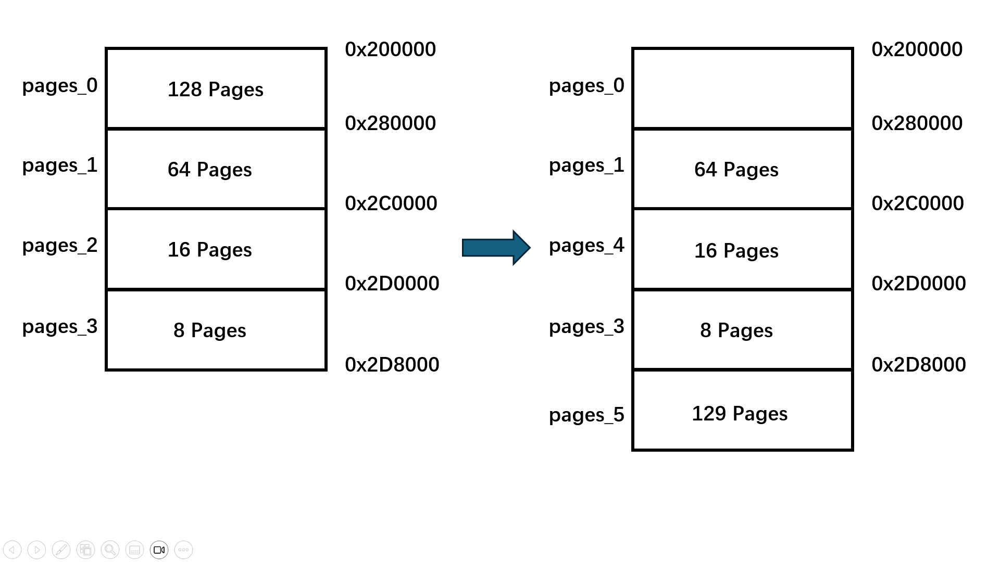

## 📌 目录
- [📌 目录](#-目录)
  - [一、实验要求](#一实验要求)
  - [二、实验过程\&关键代码](#二实验过程关键代码)
    - [Assignment 1](#assignment-1)
      - [1. 阅读示例代码的一些思考](#1-阅读示例代码的一些思考)
        - [位图部分](#位图部分)
        - [地址池部分](#地址池部分)
        - [物理页内存管理部分](#物理页内存管理部分)
        - [二级分页机制部分](#二级分页机制部分)
      - [2. 修改代码实现内存管理](#2-修改代码实现内存管理)
    - [Assignment 2](#assignment-2)
    - [Assignment 3](#assignment-3)
      - [1. 阅读示例代码的一些思考](#1-阅读示例代码的一些思考-1)
        - [分析虚拟页内存分配的三步过程和虚拟页内存释放](#分析虚拟页内存分配的三步过程和虚拟页内存释放)
      - [2. 构造测试例子](#2-构造测试例子)
    - [Assignment 4](#assignment-4)
  - [三、实验结果](#三实验结果)
    - [1](#1)
    - [2](#2)
    - [3](#3)
    - [4](#4)
  - [四、总结](#四总结)
### 一、实验要求
- 学习如何使用位图和地址池来管理资源
- 实现在物理地址空间下的内存管理
- 开启二级分页机制
- 实现在虚拟地址空间下的内存管理
### 二、实验过程&关键代码
#### Assignment 1
> - 复现参考代码，实现二级分页机制，并能够在虚拟机地址空间中进行内存管理，包括内存的申请和释放等，截图并给出过程解释。
##### 1. 阅读示例代码的一些思考
###### 位图部分
- 首先实现位图，位图在代码中表示为 `char* bitmap`，一个 `char` 代表一个字节也就是 8 位，这里的 8 位就表示了 8 个页框的使用情况
- 所以在获取某一个页框的使用情况时：
    ```cpp
    bool BitMap::get(const int index) const
    {
        int pos = index / 8;
        int offset = index % 8;

        return (bitmap[pos] & (1 << offset));
    }
    ```
    - `index / 8` 就是获取当前页框所在的字节
    - `index % 8` 就是获取当前页框在字节中的偏移量
    - `bitmap[pos] & (1 << offset)` 就是获取当前页框的使用情况
    - 注意：只是存储的时候将 8 位的字节存储在一个 `char` 中，一个 `index` 还是代表一个页框的使用情况
###### 地址池部分
- 地址池`AddressPool`在位图的基础上搭建，类中有两个元素：
  - `BitMap bitmap`：表示位图类
  - `int startAddress;`：表示标识的地址空间的起始地址
- 地址池的实现主要是对位图的封装，提供了申请和释放页框的接口
- 分配与释放页框的实现
    ```cpp
    // 从地址池中分配count个连续页
    int AddressPool::allocate(const int count)
    {
        int start = resources.allocate(count);
        return (start == -1) ? -1 : (start * PAGE_SIZE + startAddress);
    }

    // 释放若干页的空间
    void AddressPool::release(const int address, const int amount)
    {
        resources.release((address - startAddress) / PAGE_SIZE, amount);
    }
    ```
    - 注意从地址池中分配的是连续的页
    - 分配时调用 `int BitMap::allocate(const int count)` 来分配页框，如果分配成功就返回开始分配处的 `index` 的值，那么地址池中的第`i`页的起始地址`address`为  $address=startAddress+ i × PAGE\_ SIZE$
    - 释放时调用 `void BitMap::release(const int index, const int count)` 来释放页框，释放的页框是连续的，所以只需要传入开始页框的 `index`（通过`(address - startAddress) / PAGE_SIZE` 计算） 和要释放的页框数量 `count` 即可
###### 物理页内存管理部分
- 根据示例代码可以初步画出内存结构如下：
    
###### 二级分页机制部分
- 二级页表：
  
  - 注意区分页目录表和页表
- 开启二级页表机制
  - 为了访问方便，对于 `0 ~ 1MB` 的内存区域虚拟地址和物理地址相同（恒等映射）
  - 页目录表存放在`1MB`处：`#define PAGE_DIRECTORY 0x100000`
  - 
##### 2. 修改代码实现内存管理
> - 只针对物理页实现内存管理
- 示例代码已经在 `MemoryManager` 类中实现了 `allocatePhysicalPages` 和 `releasePhysicalPages` 方法，因此我在 `setup.cpp` 中调用这两个方法来实现物理页的申请和释放
- 修改 `setup.cpp` 中的 `first_thread` 函数，添加了物理页的申请和释放
    ```cpp
    void first_thread(void *arg)
    {
        // 清屏
        stdio.moveCursor(0);
        for (int i = 0; i < 25 * 80; ++i)
        {
            stdio.print(' ');
        }
        stdio.moveCursor(0);

        printf("Test starts...\n\n");
        
        // 申请内核物理页
        printf("Testing kernel physical memory allocation :\n");
        int kernelPages = 3; // 申请3页用户内存
        char *kernelAddr = (char *)memoryManager.allocatePhysicalPages(AddressPoolType::KERNEL, kernelPages);
        
        if (kernelAddr != (char*)-1) {
            printf("Successfully applied for %d pages, start: 0x%x\n",kernelPages ,kernelAddr);
            // 释放内存
            printf("\nReleasing kernel physical pages...\n");
            memoryManager.releasePhysicalPages(AddressPoolType::KERNEL, (int)kernelAddr, kernelPages);
            printf("Release successfully!\n");
        } else {
            printf("Kernel physical page request failed!\n");
        }
        
        // 申请用户物理页
        printf("\nTesting user physical memory allocation ::\n");
        int userPages = 3; // 申请3页用户内存
        char *userAddr = (char *)memoryManager.allocatePhysicalPages(AddressPoolType::USER, userPages);
        
        if (userAddr != (char*)-1) {
            printf("Successfully applied for %d pages, start: 0x%x\n", userPages, userAddr);
            // 释放内存
            printf("\nReleasing user physical pages...\n");
            memoryManager.releasePhysicalPages(AddressPoolType::USER, (int)userAddr, userPages);
            printf("Release successfully!\n");
        } else {
            printf("User physical page request failed!\n");
        }
        // 线程不可返回
        asm_halt();
    }
    ```
    - 分别申请了 3 页内核物理页和 3 页用户物理页
    - 申请成功后打印申请的页数和起始地址
    - [实验结果](#1)
#### Assignment 2
> - 参照理论课上的学习的物理内存分配算法如first-fit, best-fit等实现动态分区算法等，或者自行提出自己的算法
- 示例代码展示的已经是一个简单的 first-fit 算法了，所以这里我尝试实现一个简单的 best-fit 算法
- best-fit 算法：在所有空闲的内存块中，选择最小的一个来分配给请求的内存块
- 实现思路：
  - 遍历位图
  - 设置两个新变量：`bestStart` 和 `bestSize`，分别表示最佳匹配的起始位置和最佳匹配的大小，在遍历的过程中更新这两个变量
  - 如果能找到最佳匹配的空闲内存块，就分配给请求的内存块
- 修改 `BitMap` 类中的 `allocate` 方法：
    ```cpp
    int BitMap::allocate(const int count)
    {
        if (count <= 0)
            return -1;

        int index, empty, start;
        
        int bestStart = -1;      // 最佳匹配的起始位置
        int bestSize = length+1; // 最佳匹配的大小（初始值设置为比位图长度还大）
        
        index = 0;
        while (index < length)
        {
            // 越过已经分配的资源
            while (index < length && get(index))
                ++index;
                
            // 不存在连续的count个资源
            if (index == length)
                return -1;
                
            // 找到未分配的资源，计算大小
            empty = 0;
            start = index;
            while (index < length && !get(index))
            {
                ++empty;
                ++index;
            }
            
            // 更新最佳匹配
            if (empty >= count && empty < bestSize)
            {
                bestStart = start;
                bestSize = empty;
            }
        }
        
    
        if (bestStart != -1)
        {
            // 分配资源
            for (int i = 0; i < count; ++i)
            {
                set(bestStart + i, true);
            }
            return bestStart;
        }
        
        // 没有找到足够大的空间
        return -1;
    }
    ```
- 在 `setup.cpp` 中的 `first_thread` 函数中加入教程给出的示例：
    ```cpp
    void first_thread(void *arg)
    {
        // 第1个线程不可以返回
        stdio.moveCursor(0);
        for (int i = 0; i < 25 * 80; ++i)
        {
            stdio.print(' ');
        }
        stdio.moveCursor(0);

        char *pages_0 = (char *)memoryManager.allocatePhysicalPages(AddressPoolType::KERNEL, 128);
        printf("Allocated 128 pages for pages_0, starting at 0x%x.\n", pages_0);

        char *pages_1 = (char *)memoryManager.allocatePhysicalPages(AddressPoolType::KERNEL, 64);
        printf("Allocated 64 pages for pages_1, starting at 0x%x.\n", pages_1);

        char *pages_2 = (char *)memoryManager.allocatePhysicalPages(AddressPoolType::KERNEL, 16);
        printf("Allocated 16 pages for pages_2, starting at 0x%x.\n", pages_2);

        char *pages_3 = (char *)memoryManager.allocatePhysicalPages(AddressPoolType::KERNEL, 8);
        printf("Allocated 8 pages for pages_3, starting at 0x%x.\n", pages_3);

        memoryManager.releasePhysicalPages(AddressPoolType::KERNEL, int(pages_0), 128);
        printf("Released 128 pages for pages_0.\n");

        memoryManager.releasePhysicalPages(AddressPoolType::KERNEL, int(pages_2), 16);
        printf("Released 16 pages for pages_2.\n");

        char *pages_4 = (char *)memoryManager.allocatePhysicalPages(AddressPoolType::KERNEL, 16);
        printf("Allocated 16 pages for pages_4, starting at 0x%x.\n", pages_4);

        char *pages_5 = (char *)memoryManager.allocatePhysicalPages(AddressPoolType::KERNEL, 129);
        printf("Allocated 129 pages for pages_5, starting at 0x%x.\n", pages_5);

        asm_halt();
    }
    ```
    - 首先申请了 128 页、64 页、16 页和 8 页的内核物理页
    - 然后释放了 128 页和 16 页的内核物理页
    - 最后再次申请 16 页和 129 页的内核物理页
    - 由 `best-fit` 算法，可以预先判断：
      - 申请 16 页的内核物理页的起始地址应该是第一次申请的 16 页的内核物理页的起始地址
      - 而申请 129 页的内核物理页的起始地址应该跟着第一次申请的 8 页的内核物理页的后面（因为释放出的 128 页和 16 页的内核物理页的内存不能满足 129 页的内核物理页的申请）
    - 
#### Assignment 3
> - 复现“虚拟页内存管理”一节的代码，完成如下要求。
>   - 结合代码分析虚拟页内存分配的三步过程和虚拟页内存释放。
>   - 构造测试例子来分析虚拟页内存管理的实现是否存在bug。如果存在，则尝试修复并再次测试。否则，结合测例简要分析虚拟页内存管理的实现的正确性。
##### 1. 阅读示例代码的一些思考
- 
- 共有四种地址空间：内核地址空间、用户地址空间、内核虚拟地址空间和用户虚拟地址空间（并非全局的，每一个线程都有自己的虚拟地址池）
- 为了实现用户进程的通信，将内核虚拟地址空间映射到用户虚拟地址空间的 3GB ~ 4GB（0xc0000000 ~ 0xffffffff）范围内。这样，每一个用户进程的 3GB ~ 4GB 范围都是共享的内核空间
  - 观察 3GB ~ 4GB 范围内的地址空间，可以得到对应的页目录项是第 768 ~ 1023 个页目录项
  - `directory[768] = directory[0];` 前面已经将第 768 个页目录项映射到第 0 个页目录项，所以访问 3GB ~ 4GB 的范围的虚拟地址时，访问的便是内核
###### 分析虚拟页内存分配的三步过程和虚拟页内存释放
- 分配虚拟页内存的三步过程：
  1. 从虚拟地址池中分配若干虚拟页
  2. 从物理地址池中分配一个物理页
  3. 为虚拟页建立页目录项和页表项
```cpp
int MemoryManager::allocatePages(enum AddressPoolType type, const int count)
{
    // 第一步：从虚拟地址池中分配若干虚拟页
    int virtualAddress = allocateVirtualPages(type, count);
    if (!virtualAddress)
    {
        return 0;
    }

    bool flag;
    int physicalPageAddress;
    int vaddress = virtualAddress;

    // 依次为每一个虚拟页指定物理页
    for (int i = 0; i < count; ++i, vaddress += PAGE_SIZE)
    {
        flag = false;
        // 第二步：从物理地址池中分配一个物理页
        physicalPageAddress = allocatePhysicalPages(type, 1);
        if (physicalPageAddress)
        {
            //printf("allocate physical page 0x%x\n", physicalPageAddress);

            // 第三步：为虚拟页建立页目录项和页表项，使虚拟页内的地址经过分页机制变换到物理页内。
            flag = connectPhysicalVirtualPage(vaddress, physicalPageAddress);
        }
        else
        {
            flag = false;
        }

        // 分配失败，释放前面已经分配的虚拟页和物理页表
        if (!flag)
        {
            // 前i个页表已经指定了物理页
            releasePages(type, virtualAddress, i); 
            // 剩余的页表未指定物理页
            releaseVirtualPages(type, virtualAddress + i * PAGE_SIZE, count - i);
            return 0;
        }
    }

    return virtualAddress;
}
```
- 如果分配失败要释放资源：
  - 为什么释放虚拟页只有：`releaseVirtualPages(type, virtualAddress + i * PAGE_SIZE, count - i);` 看起来像是只释放了后面未分配的虚拟页？
  - 这是因为前面的虚拟页已经跟物理页建立了联系，`releasePages(type, virtualAddress, i);` 这里面会释放前面已经分配的包括：**虚拟页**和物理页
- 重点讲讲 `connectPhysicalVirtualPage`
  - `connectPhysicalVirtualPage` 的实现：
      ```cpp
      bool MemoryManager::connectPhysicalVirtualPage(const int virtualAddress, const int physicalPageAddress)
      {
          // 计算虚拟地址对应的页目录项和页表项
          int *pde = (int *)toPDE(virtualAddress);
          int *pte = (int *)toPTE(virtualAddress);

          // 页目录项无对应的页表，先分配一个页表
          if(!(*pde & 0x00000001)) 
          {
              // 从内核物理地址空间中分配一个页表
              int page = allocatePhysicalPages(AddressPoolType::KERNEL, 1);
              if (!page)
                  return false;

              // 使页目录项指向页表
              *pde = page | 0x7;
              // 初始化页表
              char *pagePtr = (char *)(((int)pte) & 0xfffff000);
              memset(pagePtr, 0, PAGE_SIZE);
          }

          // 使页表项指向物理页
          *pte = physicalPageAddress | 0x7;

          return true;
      }
      ```
      - 首先需要计算虚拟地址对应的页目录项和页表项的虚拟地址
        - 为什么需要计算对应的页目录项和页表项的虚拟地址？
          - 从一个虚拟地址开始：我们的目的是将它转化为物理地址。
          - 怎么转化呢？解析这个地址我们可以得到页目录项和页表项序号（注意：这里仅仅简单划分的话，得到的只是序号）
          - 但是要得到页目录项里面的内容（也就是指向的页表的物理地址[31 ~ 12 位]），需要 CPU 来读取，那 CPU 怎么读取呢？它需要知道这个页目录项的虚拟地址，所以我们需要计算出这个页目录项的虚拟地址让 CPU 来读取里面的内容
          - 同样地，我们也需要得到页表项的虚拟地址，CPU 才能读取到页表项里面的物理页的物理地址[31 ~ 12 位]
        - 具体的构造方法 [课程指导](https://gitee.com/kpyang5/sysu-2025-spring-operating-system/tree/main/lab7#%E9%A1%B5%E5%86%85%E5%AD%98%E5%88%86%E9%85%8D) 写得很清楚，其实主要入手点就是虚拟地址的三个组成部分，只要思考每一个组成部分填什么就能凑出一个虚拟地址
      - 计算出来页目录项和页表项的虚拟地址后，我们就能得到页表项里面的内容了
        - 首先判断这个页目录项有没有对应的页表，如果没有就分配一个页表（与 `0x00000001` 进行与运算其实就是得到页表项中的 P 位）
         
        - 如果没有对应的页表，就分配一个页表，并且将页目录项指向这个页表
        - 最后将页表项指向物理页
##### 2. 构造测试例子
- 在这里设计三个测试：
  - 在申请过但已释放的内存页上重新申请新的内存页
  - 检验内存管理机制的正确性
  - 申请较小的和较大的内存页
- 代码：
    ```cpp
    void first_thread(void *arg)
    {
        // 第1个线程不可以返回
        stdio.moveCursor(0);
        for (int i = 0; i < 25 * 80; ++i)
        {
            stdio.print(' ');
        }
        stdio.moveCursor(0);

        // 在同个地方两次分配
        printf("=======Test 1=======\n");
        char *pages_0 = (char *)memoryManager.allocatePages(AddressPoolType::KERNEL, 128);
        printf("Allocated 128 pages for pages_0, starting at 0x%x.\n", pages_0);

        memoryManager.releasePages(AddressPoolType::KERNEL, int(pages_0), 128);
        printf("Released 128 pages for pages_0.\n");

        char *pages_0_ = (char *)memoryManager.allocatePages(AddressPoolType::KERNEL, 128);
        printf("Allocated 128 pages again, starting at 0x%x.\n", pages_0_);
        
        memoryManager.releasePages(AddressPoolType::KERNEL, int(pages_0_), 128); // 释放内存进入下一个测试
        printf("Released 128 pages for pages_0_.\n");

        // 释放中间内存，再分别申请小于这个中间空位和大于这个中间空位的内存
        printf("=======Test 2=======\n");
        char *pages_1 = (char *)memoryManager.allocatePages(AddressPoolType::KERNEL, 64);
        printf("Allocated 64 pages for pages_1, starting at 0x%x.\n", pages_1);

        char *pages_2 = (char *)memoryManager.allocatePages(AddressPoolType::KERNEL, 16);
        printf("Allocated 16 pages for pages_2, starting at 0x%x.\n", pages_2);

        char *pages_3 = (char *)memoryManager.allocatePages(AddressPoolType::KERNEL, 8);
        printf("Allocated 8 pages for pages_3, starting at 0x%x.\n", pages_3);

        memoryManager.releasePages(AddressPoolType::KERNEL, int(pages_2), 16); // 释放中间内存
        printf("Released 16 pages for pages_2.\n");

        char *pages_4 = (char *)memoryManager.allocatePages(AddressPoolType::KERNEL, 8); // 申请小于中间空位的内存
        printf("Allocated 8 pages for pages_4, starting at 0x%x.\n", pages_4);
        memoryManager.releasePages(AddressPoolType::KERNEL, int(pages_4), 8);
        printf("Released 8 pages for pages_4.\n");

        char *pages_5 = (char *)memoryManager.allocatePages(AddressPoolType::KERNEL, 64); // 申请大于中间空位的内存
        printf("Allocated 64 pages for pages_5, starting at 0x%x.\n", pages_5);

        memoryManager.releasePages(AddressPoolType::KERNEL, int(pages_1), 64); // 释放内存进入下一个测试
        memoryManager.releasePages(AddressPoolType::KERNEL, int(pages_3), 8);
        memoryManager.releasePages(AddressPoolType::KERNEL, int(pages_5), 64);
        printf("Released all remaining pages.\n");
        
        // 尝试申请小的内存和大的内存（边缘情况）
        printf("=======Test 3=======\n");
        char *pages_6 = (char *)memoryManager.allocatePages(AddressPoolType::KERNEL, 1);
        printf("Allocated 1 page for pages_6, starting at 0x%x.\n", pages_6);
        char *pages_7 = (char *)memoryManager.allocatePages(AddressPoolType::KERNEL, 666);
        printf("Allocated 666 pages for pages_7, starting at 0x%x.\n", pages_7);

        memoryManager.releasePages(AddressPoolType::KERNEL, int(pages_6), 64); // 释放内存
        memoryManager.releasePages(AddressPoolType::KERNEL, int(pages_7), 666); 
        printf("Released all remaining pages.\n");
        
        asm_halt();
    }
    ```
#### Assignment 4
> - 参照理论课上虚拟内存管理的页面置换算法如FIFO、LRU等，实现页面置换，也可以提出自己的算法。
- 这里实现了 FIFO 页面置换算法
- 由于实验还未实现从磁盘上读取页面以及实现置换，所以这里的页面置换算法只是简单地用自定义 `char*` 数组来模拟内存（大小我设置为 3）
- 代码：
    ```cpp
    int search_and_repalce(char* page, char *FIFO_list[])
    {
        int i;
        for (i = 0; i < 3; i++)
        {
            if (FIFO_list[i] == page)
            {
                printf("Hit! Page 0x%x is already in the frame!\n", page);
                return 1;
            }
        }
        FIFO_list[0] = FIFO_list[1];
        FIFO_list[1] = FIFO_list[2];
        FIFO_list[2] = page;
        printf("Miss! Page 0x%x is added to the frame\n", page);
        return 0;
    }


    void first_thread(void *arg)
    {
        // 第1个线程不可以返回
        stdio.moveCursor(0);
        for (int i = 0; i < 25 * 80; ++i)
        {
            stdio.print(' ');
        }
        stdio.moveCursor(0);

        // FIFO
        printf("======Test FIFO======\n");

        char *page_1 = (char *)memoryManager.allocatePages(AddressPoolType::KERNEL, 1);
        //printf("Allocated page_1, starting at 0x%x.\n", page_1);
        char *page_2 = (char *)memoryManager.allocatePages(AddressPoolType::KERNEL, 1);
        //printf("Allocated page_2, starting at 0x%x.\n", page_2);
        char *page_3 = (char *)memoryManager.allocatePages(AddressPoolType::KERNEL, 1);
        //printf("Allocated page_3, starting at 0x%x.\n", page_3);
        char *page_4 = (char *)memoryManager.allocatePages(AddressPoolType::KERNEL, 1);
        //printf("Allocated page_4, starting at 0x%x.\n", page_4);
        char *page_5 = (char *)memoryManager.allocatePages(AddressPoolType::KERNEL, 1);
        //printf("Allocated page_5, starting at 0x%x.\n", page_5);
        char *page_6 = (char *)memoryManager.allocatePages(AddressPoolType::KERNEL, 1);
        //printf("Allocated page_6, starting at 0x%x.\n", page_6);
        char *page_7 = (char *)memoryManager.allocatePages(AddressPoolType::KERNEL, 1);
        // printf("Allocated page_7, starting at 0x%x.\n", page_7);
        printf("Allocated 7 pages in total: 0x%x 0x%x 0x%x 0x%x 0x%x 0x%x 0x%x\n", page_1, page_2, page_3, page_4, page_5, page_6, page_7);

        char * pagelist[10] = {page_1,page_1,page_2,page_3,page_2,page_4,page_5,page_3,page_6,page_7};
        
        char* FIFO_list[3] = {nullptr,nullptr,nullptr};

        for(int i =0;i < 10;i++)
        {
            search_and_repalce(pagelist[i], FIFO_list);
            printf("Now what is in the frame? :");
            for(int i = 0; i < 3; i++)
            {
                printf("page: 0x%x ", FIFO_list[i]);
            }
            printf("\n");
        }

        asm_halt();
    }
    ```
    - 这里的 `search_and_repalce` 函数就是实现 FIFO 页面置换算法
    - `FIFO_list` 数组就是模拟内存
    - `pagelist` 数组就是模拟访问的页面
    - `search_and_repalce` 函数会遍历 `FIFO_list` 数组，如果在 `FIFO_list` 数组中找到了对应的页面，就返回 1，否则就将页面利用 FIFO 的原理添加到 `FIFO_list` 数组中，并返回 0
    
### 三、实验结果
#### 1
- 开启二级分页机制
  
- 在虚拟机地址空间中进行内存管理
  
  - 可以看到，成功申请了 3 页内核物理页和 3 页用户物理页，并且释放成功
- ps：为了查看申请的页数是否正确，我在申请 3 页内核物理页后再申请了 3 页内核物理页，查看申请地址
  
  - 可以看到，新申请的 3 页内核物理页的起始地址为 `0x203000`，和之前申请的 3 页内核物理页的起始地址 `0x200000` 相差了 3 页的大小 `3 * PAGE_SIZE = 3 * 4096 B = 0x3000 B`，所以可以证明申请的页数是正确的
#### 2
- 实验结果：
  
  - 可以看到各个“页”的起始地址都符合预期
#### 3
- 实验结果：
    
    - 可以看到，第一个测试成功实现在申请过（已释放）的内存页上再申请新的内存页
    - 第二个测试中：
      - 当申请的页大小小于遗留空位时，能在遗留空位申请到新的内存页
      - 当申请的页大小大于遗留空位时，能在已经申请的内存页后面申请到新的内存页
    - 第三个测试能够申请小的（1 页）内存页，也能成功申请到大的（666 页）内存页
#### 4
- 实验结果
   
   - 先申请了 7 个页
   - 然后在只能存储 3 个页的“模拟内存”中成功实现 FIFO 置换算法
### 四、总结
- 本次实验难点主要在阅读教程以及示例代码时的对内存中：位图，地址池，分页机制，虚拟内存的开启等等的理解，确实花了很多时间
- 在实现过程中，主要是对示例代码的理解和修改，整体思路还是比较清晰的
- 对虚拟页内存管理的理解还不够深入，可能上述某些自己的理解的有错误
- 在 Assignment 3 测试虚拟页内存管理的实现是否存在bug时，还可以设置更多的测试不同方面测试用例来验证
- Assignment 4 中的 FIFO 页面置换算法没有真正实现内存置换
- 学习第六章内存管理加深了对课本理论知识的理解 :+1: