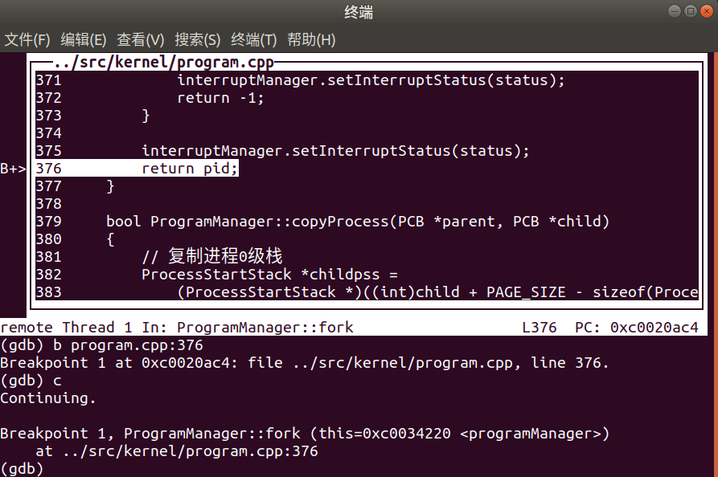
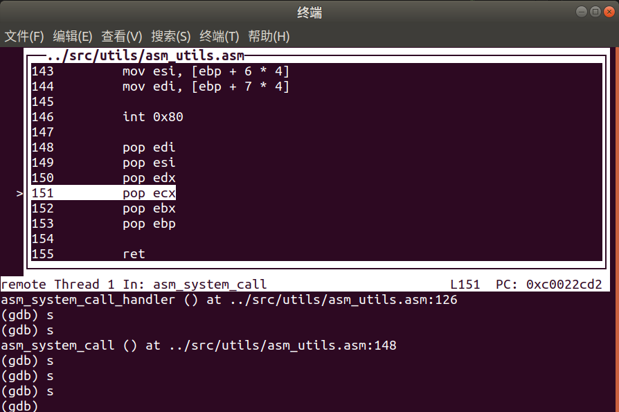
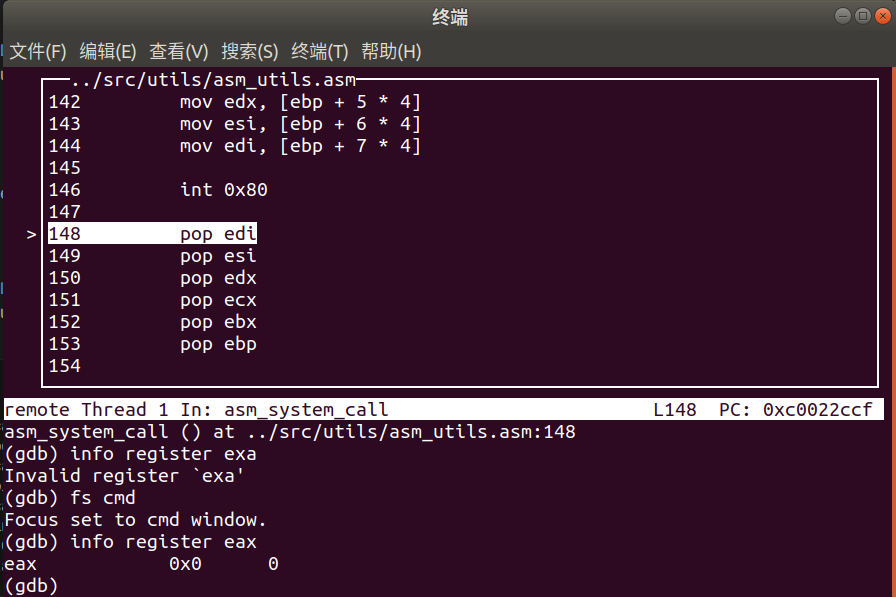

## 📌 目录
- [📌 目录](#-目录)
  - [一、实验要求](#一实验要求)
  - [二、实验过程\&关键代码](#二实验过程关键代码)
    - [Assignment 1 系统调用](#assignment-1-系统调用)
      - [1. 创建自己的一个系统调用](#1-创建自己的一个系统调用)
      - [2. 分析执行系统调用后的栈的变化情况](#2-分析执行系统调用后的栈的变化情况)
        - [内核](#内核)
        - [用户](#用户)
      - [3. 说明TSS在系统调用执行过程中的作用](#3-说明tss在系统调用执行过程中的作用)
    - [Assignment 1.5 （加入更多的系统调用）](#assignment-15-加入更多的系统调用)
    - [Assignment 2 Fork的奥秘](#assignment-2-fork的奥秘)
      - [1. 根据代码逻辑和执行结果来分析fork实现的基本思路](#1-根据代码逻辑和执行结果来分析fork实现的基本思路)
      - [2. 跟踪子进程](#2-跟踪子进程)
      - [3. fork 是如何保证子进程的 fork 返回值是 0，而父进程的 fork 返回值是子进程的 pid](#3-fork-是如何保证子进程的-fork-返回值是-0而父进程的-fork-返回值是子进程的-pid)
    - [Assignment 3 哼哈二将 wait \& exit](#assignment-3-哼哈二将-wait--exit)
      - [1. 分析 exit 的执行过程](#1-分析-exit-的执行过程)
        - [1.1 进程](#11-进程)
        - [1.2 线程](#12-线程)
      - [2. 分析进程退出后能够隐式地调用exit和此时的exit返回值是0的原因](#2-分析进程退出后能够隐式地调用exit和此时的exit返回值是0的原因)
      - [3. 分析 wait 的执行过程](#3-分析-wait-的执行过程)
      - [4. 僵尸进程的回收](#4-僵尸进程的回收)
  - [三、实验结果](#三实验结果)
    - [1](#1)
    - [1.5](#15)
    - [2](#2)
    - [3](#3)
  - [四、总结](#四总结)
### 一、实验要求
- 学习从内核态转向用户态
- 了解特权级，实现系统调度
### 二、实验过程&关键代码
#### Assignment 1 系统调用
##### 1. 创建自己的一个系统调用
> 在 src/1 基础上修改
- 编写 `syscall_1` 函数，实现对传入的五个参数进行从小到大的排序
  - 在 `syscall.h` 文件中添加 `syscall_1` 的声明
  - 在 `setup.cpp` 中实现：
    ```cpp
    void syscall_1(int first, int second, int third, int forth, int fifth)
    {
        int arr[5] = {first, second, third, forth, fifth};
        // 冒泡排序
        for (int i = 0; i < 4; ++i)
        {
            for (int j = 0; j < 4 - i; ++j)
            {
                if (arr[j] > arr[j + 1])
                {
                    int temp = arr[j];
                    arr[j] = arr[j + 1];
                    arr[j + 1] = temp;
                }
            }
        }
        printf("systerm call 1: %d, %d, %d, %d, %d\n",
            arr[0], arr[1], arr[2], arr[3], arr[4]);
    }
    ```
  - 将这个函数添加到中断向量表： 
      ```cpp
      // 设置1号系统调用
      systemService.setSystemCall(1, (int)syscall_1);
      ```
- 在 `setup_kernel` 函数中调用：
    ```cpp
    printf("====== test 1 ======\n");
    asm_system_call(1, 520 ,13, 14);

    printf("====== test 2 ======\n");
    asm_system_call(1, 2025, 5, 18, 23, 07);
    ```
- 实验结果：
  
  - 可以看到正确实现了排序
##### 2. 分析执行系统调用后的栈的变化情况
###### 内核
> - src/1 目录下只实现了内核中的系统调用
- 在调用中断前后设置断点：
  - `int 80h`( 断点指令：`b asm_utils.asm:91` )；
  - `asm_system_call_handler:` ( 断点指令：`b asm_utils.asm:28` )
- 为了观察栈的变化情况，使用 `x/20x $esp` 命令查看栈的前20个元素
- 在调用中断前可以看到：
  
- 调用中断后：
  
  - 观察到栈地址从 `0x7b98` 变成了 `0x7b8c`，这是为什么？
  - 首先，现在的系统调用是在内核态下执行的，所以相对栈的地址不会突变
  - `0x7b98 - 0x7b8c = 0x0c`，也就是 12 个字节，12 个字节是因为 CPU 自动压入了 eflags、cs、eip
  - 为了验证，使用 `info register ...` 命令查看寄存器的值
    
    - 可以看到 eflags、cs 的值与栈中的值一致
    - 但是为什么 eip 的值在栈中是 `0x0002226e` 呢？其实这个值是 `int 80h` 后指令的地址。跳转到 `int 80h` 后，再次查看 eip 的值就符合了：
      
###### 用户
> - src/3 目录下实现了用户态的系统调用
- 同样的，在调用中断前后设置断点并查看栈的变化情况
  - 中断前：
    
  - 中断后：
    
    - 观察到栈地址从 `0x8048fb8` 骤变成 `0xc002568`
    - 由于现在是用户进程中，用户进程（特权级 3）调用内核进程（特权级 0），所以需要切换到内核态，而前面规定在 3 ~ 4GB 的地址空间是内核空间的共享地址。可以看到 `0xc002568` 就在这个范围内
##### 3. 说明TSS在系统调用执行过程中的作用
> 在 src/3 下调试
- TSS 本来的作用是保存当前任务的状态信息，但在这里它的作用只有：**从低特权级向高特权级转移时，为 CPU 提供 0 特权级栈所在的地址和段选择子**
- 可以调试利用 `p/x tss` 命令查看 TSS 的值，同时利用 `info register esp` 和 `info register ss` 查看当前的栈指针和栈段选择子
  - 中断前：
    - 
    - 
  - 中断后：
    - 
    - 
- 可以看到中断前后 TSS 的值没有变化，但是栈指针和栈段选择子发生了变化
- 中断调用后，ss 的值变成了 `0x10` 与 TSS 中的 `ss0` 一致，而 esp 的值变成了 `0x002568c`，在 TSS 中的 `esp0` 的值的附近（因为 TSS 中的 `esp0` 是内核态栈的起始地址，而在调用系统调用时，内核态栈会向下生长，所以 esp 的值会小于 TSS 中的 `esp0`）
#### Assignment 1.5 （加入更多的系统调用）
- 添加 `printf` 函数的系统调用：
    ```cpp
    int syscall_print(int str, int second, int third, int forth, int fifith)
    {
        printf("%s", (const char *)str);
        return 0;
    }
    ```
- 然后设置为 1 号系统调用：
    ```cpp
    // 设置1号系统调用
    systemService.setSystemCall(1, (int)syscall_print);
    ```
- 在 `first_process` 中通过系统调用实现打印 `Hello World!`
    ```cpp
    void first_process()
    {
        const char* message = "Hello World!\n";
        asm_system_call(1, (int)message, 0, 0, 0);
        asm_system_call(0, 132, 324, 12, 124);
        asm_halt();
    }
    ```
#### Assignment 2 Fork的奥秘
##### 1. 根据代码逻辑和执行结果来分析fork实现的基本思路
> - 从进程中的`fork`开始一步步调试观察
- 首先在第一个进程调用 `fork` 处设置断点
  
- 然后步入，首先进入 fork 函数：
    ```cpp
    int fork() {
        return asm_system_call(2);
    }
    ```
    然后从 `asm_system_call` 中的`int 80h` 进入 `asm_system_call_handler`，再通过 `call dword[system_call_table + eax * 4]` 进入设置的系统调用函数 `syscall_fork` 中
- 进入 `syscall_fork` 函数后，调用的是 `programManager.fork()` 函数
  
- `programManager.fork()` 函数的实现主要分为三部分：
    - 禁止内核线程调用
    - 创建子进程
    - **复制父进程的资源到子进程中**
- 重点展开 **复制父进程的资源到子进程中** 部分：
  - 首先**复制 0 特权级的栈**
    - 在示例代码中看到：
        ```cpp
        // 复制进程0级栈
        ProcessStartStack *childpss =
            (ProcessStartStack *)((int)child + PAGE_SIZE - sizeof(ProcessStartStack));
        ProcessStartStack *parentpss =
            (ProcessStartStack *)((int)parent + PAGE_SIZE - sizeof(ProcessStartStack));
        memcpy(parentpss, childpss, sizeof(ProcessStartStack));
        // 设置子进程的返回值为0
        childpps->eax = 0;
        ```
    - 为什么复制的只有 `ProcessStartStack` 呢？
      - 由 fork 的性质可以知道，子进程要在父进程 fork 的地方继续执行，那么子进程就需要知道父进程中 `asm_system_call_handler` 的返回地址和执行`asm_system_call_handler` 前保护的现场
      - 这些参数都在 `int 80h` 之前和调用 `asm_system_call_handler` 后压入栈中，所以只需要复制这些参数就可以了
      - `(int)parent + PAGE_SIZE` 是因为前面规定了 `tss.esp0 = (int)program + PAGE_SIZE;` ；而 `- sizeof(ProcessStartStack)` 是因为从进程的 0 特权级栈的栈顶到 esp 之间的内容恰好对应于 `ProgramStartStack` 的内容
    - 注意这里设置 `childpps->eax = 0` 是因为子进程的返回值要为 0
  - **初始化 0 特权级栈以及设置 PCB**：因为是通过 `asm_switch_thread` 切换到子进程的，所以需要初始化子进程的 0 特权级栈中：
    ```cpp
    child->stack[4] = (int)asm_start_process;
    child->stack[5] = 0;             // asm_start_process 返回地址
    child->stack[6] = (int)childpss; // asm_start_process 参数
    ```
    使得子进程能够从 `asm_switch_thread` 跳转到 `asm_start_proces` 处执行。
  - **复制虚拟地址池**
  - **复制页目录表**
  - **复制页表和物理页**
    - 这里会有个问题：需要设置一个中转页。这是因为父子进程使用的代码相同，虚拟地址也相同，需要在父进程的虚拟空间中将数据复制到中转页中，再在子进程的虚拟空间中将数据从中转页中复制到对应位置
- 然后跳转到 `programManager.fork()` 的末尾：
  - 
  - 这里返回了一个 `pid`，这个 `pid` 其实就是前面创建子进程时 `int pid = executeProcess("", 0);` 的返回值（就是子进程的 `pid`，也就解释了父进程中 `fork` 的返回值是子进程的 `pid`）
- 一直单步调试：
  - 
  - 
  - 
  - 
  - 
  - 可以看到一路返回到 `first_process` 中，返回值为子进程的 `pid`
- 可以用下面这张图来表示：
  
##### 2. 跟踪子进程
- 由于程序采用时间中断来调度进程，所以在 `programManager.schedule()` 中 `asm_switch_thread(cur, next);` 处设置断点，然后执行三次 `c` （执行三次才能进入子进程）
- 然后进入 `asm_switch_thread` 函数，返回后观察到成功跳转到 `asm_start_process` 函数中
  
- 按照预期，子进程应该在父进程调用 `int 80h` 后的地方继续执行，单步执行到 `asm_start_process` 返回后：
  
  - 观察到符合我们的预期返回到调用中断后面了
- 此处我们查看 `eax` 的值，不出所料就是 0，因为我们前面设置了子进程的返回值为 0
  - 
- 然后跟父进程一样返回的路径
  - 
  - 
##### 3. fork 是如何保证子进程的 fork 返回值是 0，而父进程的 fork 返回值是子进程的 pid
- 子进程返回值是 0 是因为在 `asm_start_process` 中设置了 `childpps->eax = 0;`
- 父进程的返回值是子进程的 `pid` 是因为在 `programManager.fork()` 中返回了 `pid`，而这个 `pid` 就是前面创建子进程时 `int pid = executeProcess("", 0);` 的返回值
#### Assignment 3 哼哈二将 wait & exit
##### 1. 分析 exit 的执行过程
###### 1.1 进程
- 示例代码中设置的是父亲进程（也就是 `first_process`）是不会退出的，而子进程隐式退出，所以追踪子进程的退出过程
- 在子进程返回到 `first_process` 后打印 `I am child, exit` 的地方设置断点，然后单步步入：
  
  - 观察到跳转到了 `exit` 函数，说明隐式调用 `exit` 函数成功（至于为什么能隐式调用见 [↓ 2. 分析进程退出后能够隐式地调用exit和此时的exit返回值是0的原因](#2-分析进程退出后能够隐式地调用exit和此时的exit返回值是0的原因)）
- 然后进入 `asm_system_call` 调用 `int 80h` 进入 `asm_system_call_handler`，然后进入 `syscall_exit` 函数，这里尝试打印 `ret` 的值：
  
  - 发现符合预期即为 0
- 紧接着进入 `programManager.exit()` 函数，主要干三件事：
  - 标记 PCB 状态为 `DEAD` 并放入返回值
  - 如果 PCB 标识的是进程，则释放进程所占用的物理页、页表、页目录表和虚拟地址池 bitmap 的空间
  - **立即执行线程/进程调度**
- 重点讲讲 **立即执行线程/进程调度**：
  - 进程一旦退出，内核不会等到下一次时间中断（前面我们使用时间中断来实现调度）就会立即调度其他进程来执行，直截了当地调用 `programManager.schedule()` 函数
- 前面我们还没有释放进程的 PCB，我们在 `programManager.schedule()` 中释放（注意只是`src/5`代码这么设置，后面实现 `wait` 后会在父进程中回收！），由于我们的进程状态已经设置为 `DEAD`，所以在这个函数中会跳转到：
    
    实现释放 PCB
- 然后换上下一个进程/线程执行，child 进程便结束了
###### 1.2 线程
- 接着看第二个线程的退出过程
- 在 `second_thread` 中的显示调用处 `exit(0)` 设置断点，然后单步步入：
  - 跟上面进程一样一路走到 `programManager.schedule()` 函数中（有点不同是这个过程中线程在 `ProgramManager::exit(int ret)` 函数中不用释放物理页等等）
  - 同样的在 `programManager.schedule()` 中释放 PCB
##### 2. 分析进程退出后能够隐式地调用exit和此时的exit返回值是0的原因
- 已经知道线程在结束时会自动调用 `program_exit` 返回，现在在已经实现进程退出函数 `exit` 的基础上，如何让进程在退出的时候自动调用这个 `exit` 呢？
    ```cpp
    void load_process(const char *filename)
    {

        // ...

        // 设置进程返回地址
        int *userStack = (int *)interruptStack->esp;
        userStack -= 3;
        userStack[0] = (int)exit; // 设置返回地址为 exit
        userStack[1] = 0;
        userStack[2] = 0;

        // ...
    }
    ```
    - 其实只需要在进程的 3 特权级栈中设置返回地址为 `exit`，**注意这里 `userStack[2] = 0`**，其实设置的是传入 `exit` 的参数，这也是为什么隐式调用 `exit` 返回值为 0 的原因
##### 3. 分析 wait 的执行过程
- 主要分析一下代码的逻辑：
- 首先是：`int ProgramManager::wait(int *retval)`:
  - 最外层是一个 `while(true)` 循环
  - 寻找有没有子进程可以回收（状态为 `DEAD`），则直接回收并返回子进程的 pid 
  - 如果没有子进程（通过 `flag` 判断），则直接返回 -1
  - 如果有子进程但是没有死亡，则调用 `programManager.schedule()` 函数进行调度
- 然后是 `setup.cpp` 中的 `first_process` 函数：
    ```cpp
    void first_process()
    {
        int pid = fork();
        int retval;

        if (pid)
        {
            pid = fork();
            if (pid)
            {
                while ((pid = wait(&retval)) != -1)
                {
                    printf("wait for a child process, pid: %d, return value: %d\n", pid, retval);
                }

                printf("all child process exit, programs: %d\n", programManager.allPrograms.size());
                
                asm_halt();
            }
            else
            {
                uint32 tmp = 0xffffff;
                while (tmp)
                    --tmp;
                printf("exit, pid: %d\n", programManager.running->pid);
                exit(123934);
            }
        }
        else
        {
            uint32 tmp = 0xffffff;
            while (tmp)
                --tmp;
            printf("exit, pid: %d\n", programManager.running->pid);
            exit(-123);
        }
    }
    ```
  - 总览代码，其实发现就是两个相似的判断逻辑嵌套，这个判断逻辑是判断什么的呢？是判断现在执行的是父进程还是子进程（回顾前面，父进程 `fork` 的返回值是子进程的 `pid`，而子进程的 `fork` 返回值是 0）
  - 首先父进程进行一次 `fork`，成功后进行第二次 `fork`
  - 然后父进程进入 `wait` 函数，等待子进程结束（注意这个判断条件是 `pid = wait(&retval) != -1`就是判断有没有子进程的条件），发现没有子进程结束，所以进行调度
  - 那么创建的第一个子进程现在能回到父进程 `fork` 后面的地方执行了，由于返回值是 0，所以进入 `else` 语句中（现在是外层的 `else` 语句），可以观察到 `exit` 的返回值是 -123
  - `exit` 中又有调度函数，切换到第二个子进程执行，同样的在**内层**进行判断，由于返回值也是 0，同样也是进入 `else` 语句中，调用 `exit(123934)`
  - 在`exit` 中再次调度，切换到父进程中，依次发现两个子进程结束了，依次打印 `wait for ...`
  - 最后父进程中打印 `all child process exit ...`，说明所有的子进程都结束了
- 运行一下，符合上述分析：
  
##### 4. 僵尸进程的回收
- 示例代码没有实现僵尸进程的回收，这里我使用的方法是：
  - 创建一个一直执行的 `init_process` 进程，专门负责回收僵尸进程
  - 然后在父进程退出时，将他底下还存在的子进程的 `parentPid` 设置为 `init_process` 的 `pid`，也就是让 `init_process` 负责回收
  - 同时也增添当当前进程是孤儿进程时的处理：将自己的 `parentPid` 设置为 `init_process` 的 `pid`
- 修改 `ProgramManager::exit` 函数：
    ```cpp
    void ProgramManager::exit(int ret)
    {
        interruptManager.disableInterrupt();

        PCB *program = this->running;
        program->retValue = ret;
        program->status = ProgramStatus::DEAD;

        // 接管孤儿进程
        ListItem *item = this->allPrograms.head.next;
        PCB *pcb;
        while (item)
        {
            pcb = ListItem2PCB(item, tagInAllList);
            if (pcb->parentPid == program->pid)
            {
                pcb->parentPid = 1; 
                printf("Process %d is now orphan, adopted by init process\n", pcb->pid);
            }
            item = item->next;
        }

        // 当前进程为孤儿进程时的处理
        bool isOrphan = false;
        
        if (program->parentPid != 0) 
        {
            // 检查父进程是否存在且状态是否为DEAD
            item = this->allPrograms.head.next;
            bool parentFound = false;
            bool parentDead = false;
            
            while (item)
            {
                pcb = ListItem2PCB(item, tagInAllList);
                if (pcb->pid == program->parentPid)
                {
                    parentFound = true;
                    if (pcb->status == ProgramStatus::DEAD)
                    {
                        parentDead = true;
                    }
                    break;
                }
                item = item->next;
            }
            
            // 父进程不存在或已死亡，当前进程是孤儿进程
            if (!parentFound || parentDead)
            {
                isOrphan = true;
                program->parentPid = 1; 
                printf("Process %d is orphan, changing parent to init process\n", program->pid);
            }
        }

        int *pageDir, *page;
        int paddr;

        if (program->pageDirectoryAddress)
        {
            pageDir = (int *)program->pageDirectoryAddress;
            for (int i = 0; i < 768; ++i)
            {
                if (!(pageDir[i] & 0x1))
                {
                    continue;
                }

                page = (int *)(0xffc00000 + (i << 12));

                for (int j = 0; j < 1024; ++j)
                {
                    if (!(page[j] & 0x1))
                    {
                        continue;
                    }

                    paddr = memoryManager.vaddr2paddr((i << 22) + (j << 12));
                    memoryManager.releasePhysicalPages(AddressPoolType::USER, paddr, 1);
                }

                paddr = memoryManager.vaddr2paddr((int)page);
                memoryManager.releasePhysicalPages(AddressPoolType::USER, paddr, 1);
            }

            memoryManager.releasePages(AddressPoolType::KERNEL, (int)pageDir, 1);

            int bitmapBytes = ceil(program->userVirtual.resources.length, 8);
            int bitmapPages = ceil(bitmapBytes, PAGE_SIZE);

            memoryManager.releasePages(AddressPoolType::KERNEL, (int)program->userVirtual.resources.bitmap, bitmapPages);
        }

        schedule();
    }
    ```
- 设置 `init_process` 进程：
    ```cpp
    void init_process()
    {
        int retval;
        int pid;
        
        while (true)
        {
            while ((pid = wait(&retval)) != -1)
            {
                printf("Init process reclaimed zombie process, pid: %d, return value: %d\n", pid, retval);
            }
        }

    }
    ```
- 然后在第一个进程中模拟产生僵尸进程：
    ```cpp
    void first_process()
    {
        int pid = fork();

        if (pid)
        {
            printf("exit, pid: %d\n", programManager.running->pid);
            exit(-122);
        }
        else
        {
            uint32 tmp = 0xffffff;
            while (tmp)
                --tmp;
            printf("exit, pid: %d\n", programManager.running->pid);
            exit(-123);
        }
    }
    ```
### 三、实验结果
#### 1 
- 见 ↑ [Assignment 1 || 1. 创建自己的一个系统调用 || 实验结果](#1-创建自己的一个系统调用)
#### 1.5 
- 
- 可以看到成功打印了 `Hello World!`
#### 2
- 只有调试过程，见 ↑ [Assignment 2](#assignment-2-fork的奥秘)
#### 3
- 运行结果：
  
  - 可以看到父进程退出时，子进程由 `init_process` 接管，子进程最后也成功退出了
### 四、总结
- 这次实验难度与上次旗鼓相当，由于特权级机制之前并没有接触过，所以在看实验教程的时候一头雾水，尤其是栈的变化情况，前面也没有接触过内核态和用户态的切换，所以对这块的理解还是比较肤浅的
- 当然了解了特权级的机制也是觉得操作系统的精妙之处巧夺天工，对阶级的划分和切换的设计都很巧妙
- 而 `fork`、`wait`、`exit` 的实现也让我对进程的调度有了更深的理解，尤其是 `fork` 的实现，实际实现起来有很多细节：怎样复制父进程的资源、怎样设置返回值、怎样实现父子进程的切换等等