## 📌 目录
- [📌 目录](#-目录)
  - [一、实验要求](#一实验要求)
  - [二、实验过程\&关键代码](#二实验过程关键代码)
    - [1. 示例代码分析与复现](#1-示例代码分析与复现)
      - [（1）示例代码分析](#1示例代码分析)
      - [（2）具体复现](#2具体复现)
    - [2. 线程/进程同步和互斥处理](#2-线程进程同步和互斥处理)
      - [（1）错误展示](#1错误展示)
      - [（2）解决](#2解决)
  - [三、实验结果](#三实验结果)
    - [1. 进程和线程的内存分配测试](#1-进程和线程的内存分配测试)
    - [2. 互斥锁的测试](#2-互斥锁的测试)
  - [四、总结](#四总结)
### 一、实验要求
- `malloc/free` 的实现
- 复现教程代码
- 增加线程/进程同步和互斥处理
### 二、实验过程&关键代码
#### 1. 示例代码分析与复现
##### （1）示例代码分析
- 为了实现小于页大小的内存分配，引入 `arena` 概念
- `arena` 实际上也是具有固定大小的内存单元（大小都是 $2^N$ `Bytes`） 
- 首先定义 `arena` 的几种大小：
    ```cpp
    enum ArenaType
    {
        ARENA_16,
        ARENA_32,
        ARENA_64,
        ARENA_128,
        ARENA_256,
        ARENA_512,
        ARENA_1024,
        ARENA_MORE
    };
    ```
    - 注意，超过 `1024 Bytes` 的内存分配直接标志为 `ARENA_MORE`，通过分配页来实现
- 我们在内存页上面划分一个个等大的 `arena`，那我们如何知道这个页上面有多少个 `arena` 呢？分配的 `arena` 大小又是多少呢？
  - 这时，在每个页的开头，划分一个区域来存储 “元信息”
    - 
  - 元信息定义的结构为：
    ```cpp
    struct Arena
    {
        ArenaType type; // Arena的类型
        int counter;  // 如果是ARENA_MORE，则counter表明页的数量，
                        // 否则counter表明该页中的可分配arena的数量
    };
    ```
- 划分完的页，我们有许多空闲的 `arena`，采用链表的方式来存储：
  - 
  - 注意：链表存储的是**空闲**的 `arena`，而不是已分配的 `arena`
  - 每一个 `arena` 类型都有一个对应的空闲链表
- 然后我们就可以写三个最重要的函数了：`allocate`，`getNewArena`，`release`。这三个函数主要都是对链表的操作：
  - `allocate`：
    ```cpp
    void *ByteMemoryManager::allocate(int size)
    {
        int index = 0;
        while (index < MEM_BLOCK_TYPES && arenaSize[index] < size)
            ++index;

        PCB *pcb = programManager.running;
        AddressPoolType poolType = (pcb->pageDirectoryAddress) ? AddressPoolType::USER : AddressPoolType::KERNEL;
        void *ans = nullptr;

        if (index == MEM_BLOCK_TYPES)
        {
            // 上取整
            int pageAmount = (size + sizeof(Arena) + PAGE_SIZE - 1) / PAGE_SIZE;

            ans = memoryManager.allocatePages(poolType, pageAmount);

            if (ans)
            {
                Arena *arena = (Arena *)ans;
                arena->type = ArenaType::ARENA_MORE;
                arena->counter = pageAmount;
            }
        }
        else
        {
            //printf("---ByteMemoryManager::allocate----\n");
            if (arenas[index] == nullptr)
            {
                if (!getNewArena(poolType, index))
                    return nullptr;
            }

            // 每次取出内存块链表中的第一个内存块
            ans = arenas[index];
            arenas[index] = ((MemoryBlockListItem *)ans)->next;

            if (arenas[index])
            {
                (arenas[index])->previous = nullptr;
            }

            Arena *arena = (Arena *)((int)ans & 0xfffff000);
            --(arena->counter);
            //printf("---ByteMemoryManager::allocate----\n");
        }

        return ans;
    }
    ```
    - 先根据 `size` 找到对应的 `arena` 类型
    - 如果是大于 `1024 Bytes` 的内存分配，则直接分配页
    - 如果是小于等于 `1024 Bytes` 的内存分配，则从对应的空闲链表中取出一个 `arena`
    - 如果对应的空闲链表为空，则调用 `getNewArena` 函数来从内核中分配一个页，写入元信息，划分 `arena`
    - 为了方便，我们取出的都是空闲链表的第一个 `arena`，然后将其从空闲链表中删除
    - 注意！更新相应的元信息，要记得减少 `counter` 的值！
  - `getNewArena`
  - `release`：
    ```cpp
    void ByteMemoryManager::release(void *address)
    {
        // 由于Arena是按页分配的，所以其首地址的低12位必定0，
        // 其中划分的内存块的高20位也必定与其所在的Arena首地址相同
        Arena *arena = (Arena *)((int)address & 0xfffff000);

        if (arena->type == ARENA_MORE)
        {
            int address = (int)arena;

            memeoryManager.releasePage(address, arena->counter);
        }
        else
        {
            MemoryBlockListItem *itemPtr = (MemoryBlockListItem *)address;
            itemPtr->next = arenas[arena->type];
            itemPtr->previous = nullptr;

            if (itemPtr->next)
            {
                itemPtr->next->previous = itemPtr;
            }

            arenas[arena->type] = itemPtr;
            ++(arena->counter);

            // 若整个Arena被归还，则清空分配给Arena的页
            int amount = (PAGE_SIZE - sizeof(Arena)) / arenaSize[arena->type];
            // printf("---ByteMemoryManager::release---: arena->counter: %d, amount: %d\n", arena->counter, amount);

            if (arena->counter == amount)
            {
                // 将属于Arena的内存块从链上删除
                while (itemPtr)
                {
                    if ((int)arena != ((int)itemPtr & 0xfffff000))
                    {
                        itemPtr = itemPtr->next;
                        continue;
                    }

                    if (itemPtr->previous == nullptr) // 链表中的第一个节点
                    {
                        arenas[arena->type] = itemPtr->next;
                        if (itemPtr->next)
                        {
                            itemPtr->next->previous = nullptr;
                        }
                    }
                    else
                    {
                        itemPtr->previous->next = itemPtr->next;
                    }

                    if (itemPtr->next)
                    {
                        itemPtr->next->previous = itemPtr->previous;
                    }

                    itemPtr = itemPtr->next;
                }

                memeoryManager.releasePage((int)address, 1);
            }
        }
    }
    ```
    - `release` 函数的实现比较简单，主要是将 `arena` 放回对应的空闲链表中，并更新元信息
    - 如果 `arena` 的 `counter` 达到最大值，也就是所有的 `arena` 都被释放了，则将对应的页释放掉
    - 具体的清空分配给Arena的页的过程：
      - 进入 while 循环，遍历链表上的所有内存块（itemPtr）。通过位运算 ((int)itemPtr & 0xfffff000) 判断当前 itemPtr 是否属于目标 Arena。（因为这个链表中有来自**不同页**的 `arena` ）如果不是，则跳到下一个节点。
        - 如果是属于该 Arena 的节点，则根据其在链表中的位置（头节点或中间节点）进行删除操作：
        - 如果是头节点（previous 为 nullptr），则更新 arenas 数组中对应类型的头指针，并调整下一个节点的 previous 指针。
        - 如果不是头节点，则将前一个节点的 next 指针指向当前节点的下一个节点。
        - 如果当前节点有下一个节点，还需将下一个节点的 previous 指针指向当前节点的前一个节点。
      - 删除后，继续遍历下一个节点。
##### （2）具体复现
- 先创建 `ByteMemoryManager.h`
  - 定义 `arena` 相关的枚举类型
  - 定义 `MemoryBlockListItem` 结构体
  - 定义 `ByteMemoryManager` 类
  - `extern ByteMemoryManager kernelByteMemoryManager;` 同时定义 `kernelByteMemoryManager` 的外部变量
- 然后创建 `ByteMemoryManager.cpp`
  - 实现 `ByteMemoryManager` 类的构造函数，初始化 `arenas` 数组
  - 实现 `allocate`，`getNewArena`，`release` 函数
    - *（这里注意 `release` 函数中有关释放物理页的地方的函数调用要添加是用户态何时内核态的参数）*
- 然后在 `thread.h` 中的 `PCB` 模块添加：
    ```cpp
    struct PCB
    {
        ...
        ByteMemoryManager byteMemoryManager; // 进程内存管理者
        ...
    };
    ```
- 在 `program.cpp` 中的 `executeThread` 函数中添加:
    ```cpp
    ...
    thread->ticksPassedBy = 0;
    thread->pid = ((int)thread - (int)PCB_SET) / PCB_SIZE;
    // 初始化进程的内存管理者
    thread->byteMemoryManager = ByteMemoryManager(); 
    ...
    ```
- 然后还要编写系统调用：
  - 在 `syscall.h` 中添加：
    - 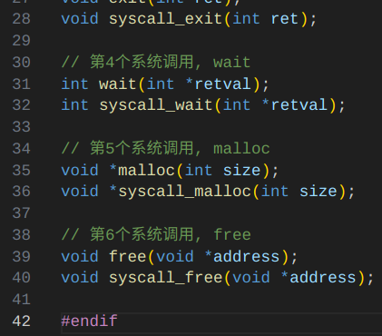
  - 在 `syscall.cpp` 中实现：
    - 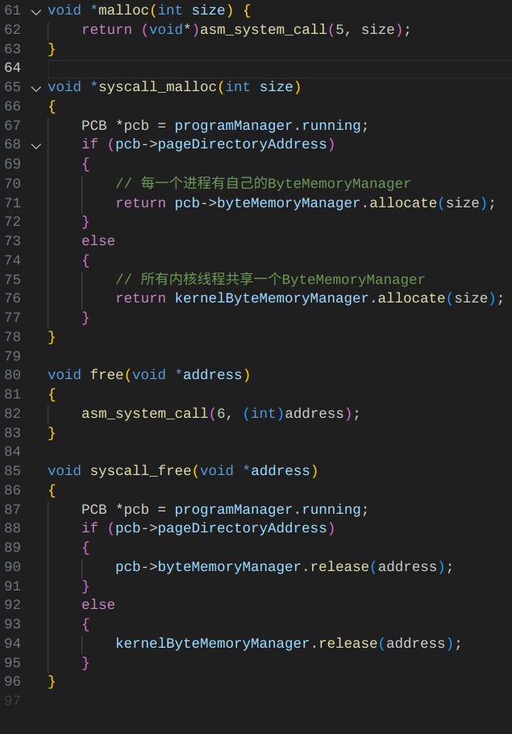
  - 在 `setup.cpp` 中添加：
    - 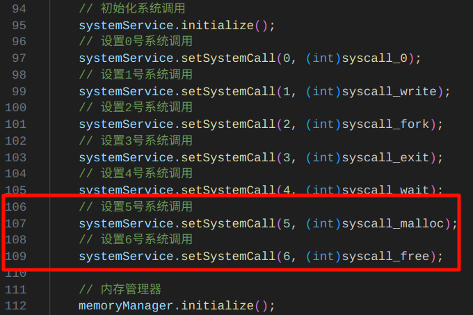
- 最后在第一个线程以及第一个进程里面编写测试：
    ```cpp
    void first_process()
    {
        printf("Test for process...\n");
        
        char *str = (char *)malloc(32);
        if (str) 
        {
            printf("Process malloc succeeded, address: 0x%x\n", (uint32)str);
            
            const char *message = "Hello Memory!";
            int len = 0;
            while (message[len]) len++; 
            
            if (len < 32) 
            { 
                for (int i = 0; i <= len; i++) 
                {
                    str[i] = message[i];
                }
            }
            
            printf("Allocated memory content: %s\n", str);
            free(str);
            printf("Process malloc freed\n");
        } 
        else 
        {
            printf("Process malloc failed\n");
        }
        
        // 测试大内存分配
        printf("Trying to allocate large memory...\n");
        char *largeStr = (char *)malloc(1024 * 1024); // 1MB
        if (largeStr) 
        {
            printf("Process large malloc succeeded, address: 0x%x\n", (uint32)largeStr);
            free(largeStr);
            printf("Process large malloc freed\n");
        } 
        else 
        {
            printf("Process large malloc failed\n");
        }
    }

    void first_thread(void *arg)
    {
        printf("\nstart thread\n");
        printf("Test for thread...\n");

        // 先在线程中测试内存分配
        char *str = (char *)malloc(32);
        if (str) {
            printf("Thread malloc success: 0x%x\n", (uint32)str);
            free(str);
            printf("Thread malloc freed\n");
        }
        printf("\nstart process\n");
        programManager.executeProcess((const char *)first_process, 1);
        asm_halt();
    }
    ```
    - 测试在线程中和进程中分配小内存
    - 测试在进程中分配大内存
    - 结果见 ↓ [进程和线程的内存分配测试](#1-进程和线程的内存分配测试)
#### 2. 线程/进程同步和互斥处理
##### （1）错误展示
- 现在的程序没有实现线程和进程的同步和互斥处理，可能会导致在多线程或多进程环境下出现内存分配错误。
- 下面展示可能出现的错误情况：
- 如果两个线程/进程同时调用 `malloc`，操作系统可能会分配同一块内存，导致内存分配错误
  - 在 `ByteMemoryManager::allocate` 函数中添加延迟并打印线程申请信息：
    ```cpp
    ...
        // 每次取出内存块链表中的第一个内存块
        ans = arenas[index];

        printf("Thread %d allocate %d bytes, address: 0x%x\n",
                pcb->pid, arenaSize[index], (int)ans);

        //error test
        int delay = 0xffffffff;
        while (delay--); // 这里是为了测试内存分配的延时

        arenas[index] = ((MemoryBlockListItem *)ans)->next;
    ...
    ```
  - 然后在 `setup.cpp` 中设置两个线程进行 `mallloc`
    ```cpp
    void second_thread(void *arg)
    {
    printf("\nsecond thread\n");
    char *str = (char *)malloc(32);
    if (str) {
        printf("Thread 1 malloc success: 0x%x\n", (uint32)str);
        free(str);
        printf("Thread 1 malloc freed\n");
    }
    }

    void first_thread(void *arg)
    {
    printf("\nstart thread\n");
    printf("Test for thread...\n");
    programManager.executeThread(second_thread, nullptr, "second", 1);

    // 先在线程中测试内存分配
    char *str = (char *)malloc(32);
    if (str) {
        printf("Thread 0 malloc success: 0x%x\n", (uint32)str);
        free(str);
        printf("Thread 0 malloc freed\n");
    }
    // printf("\nstart process\n");
    // programManager.executeProcess((const char *)first_process, 1);
    asm_halt();
    }
    ```
- 运行后可能会出现以下错误：
  - 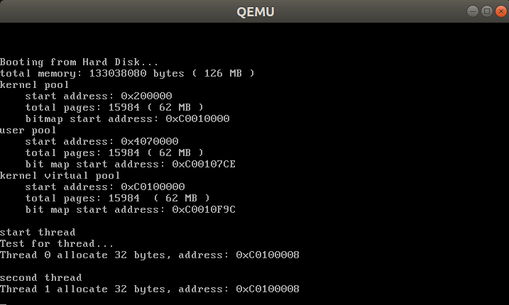
  - 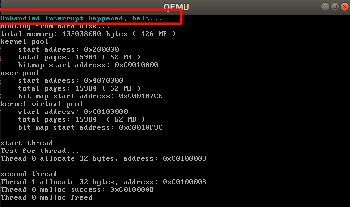
##### （2）解决
> - 可以通过在创建线程调用malloc函数的前后加锁和解锁来解决这个问题。
> - 但是总不能要求每次写 `malloc` 都能记得加锁和解锁吧？实在麻烦！
> - **所以我考虑可以在 `ByteMemoryManager` 类中添加一个互斥锁 `mutex`，然后在 `allocate` 和 `release` 函数中加锁和解锁。**
- 首先在头文件 `ByteMemoryManager.h` 类 `ByteMemoryManager` 中添加互斥锁：
  - 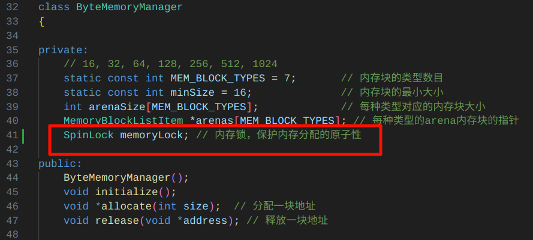
- 在初始化函数初始化这个互斥锁：
  - 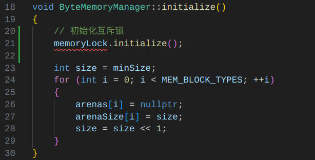
- 然后在 `ByteMemoryManager.cpp` 中的 `allocate` 和 `release` 函数中添加加锁和解锁：
  - `allocate` 函数有两个出口：
    - 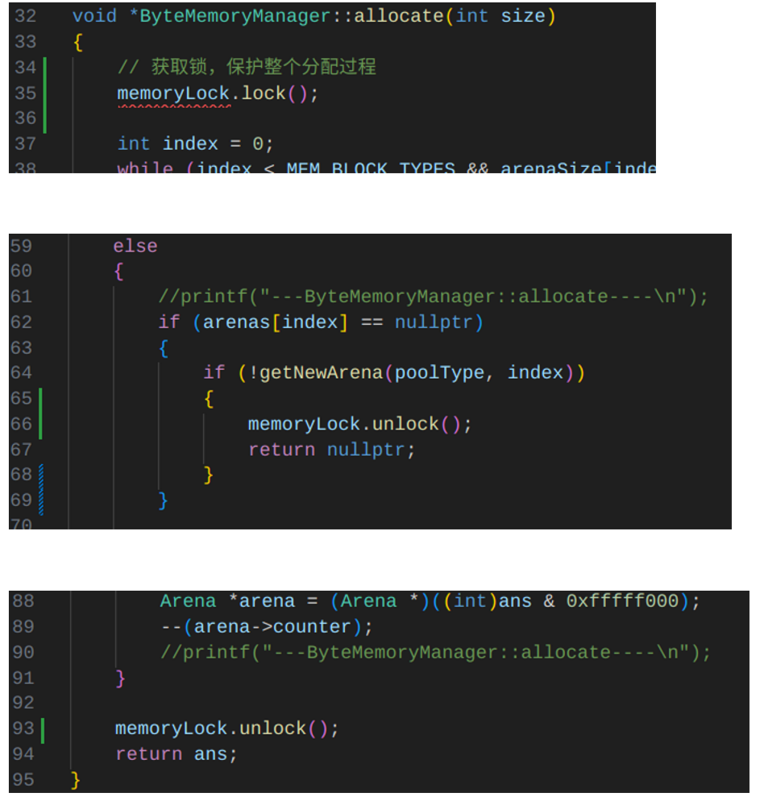
  - `release` 函数一头一尾：
    - 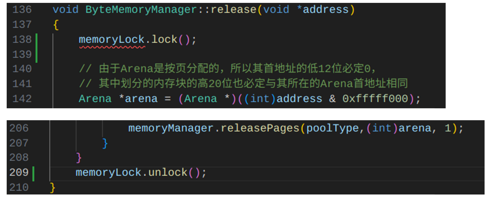
- 运行结果：
  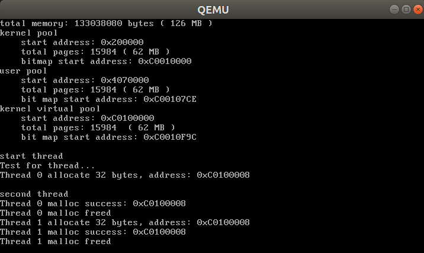
  - 可以看到，两个线程都可以正常分配内存，并且没有出现错误。
### 三、实验结果
#### 1. 进程和线程的内存分配测试
- 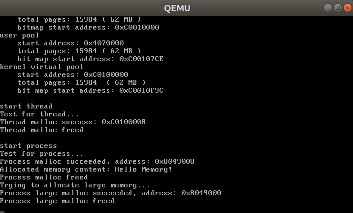
  - 可以看到，进程和线程都可以正常分配小内存和大内存，并且释放内存后没有出现错误。
#### 2. 互斥锁的测试
- 见 ↑ [2. 线程/进程同步和互斥处理](#2-线程进程同步和互斥处理)
### 四、总结
- 本次实验参考了实验教程的代码，完成了 `malloc/free` 的实现
- 了解了 `arena` 的概念以及如何划分内存页
- `arena` 的链表相关操作让我看了好久的代码（对相关操作遗忘了，所以理解了很久）
- 在实现线程和进程的内存分配的基础上，增加了线程和进程的同步和互斥处理
- 通过互斥锁的方式解决了多线程和多进程环境下的内存分配错误问题
